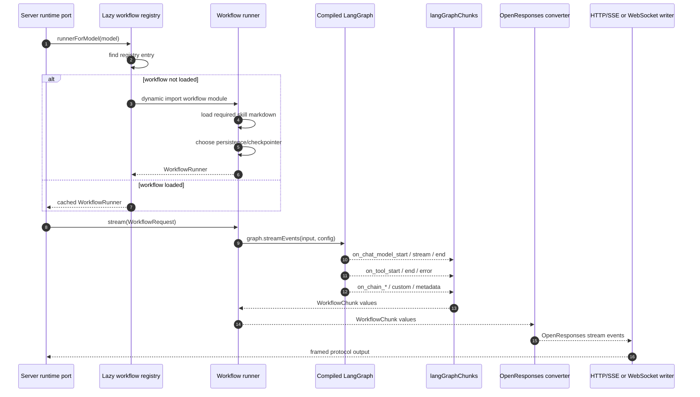
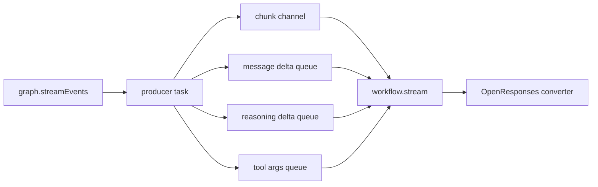
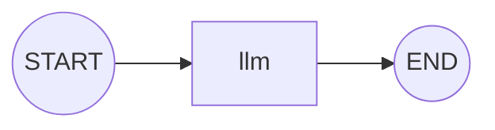
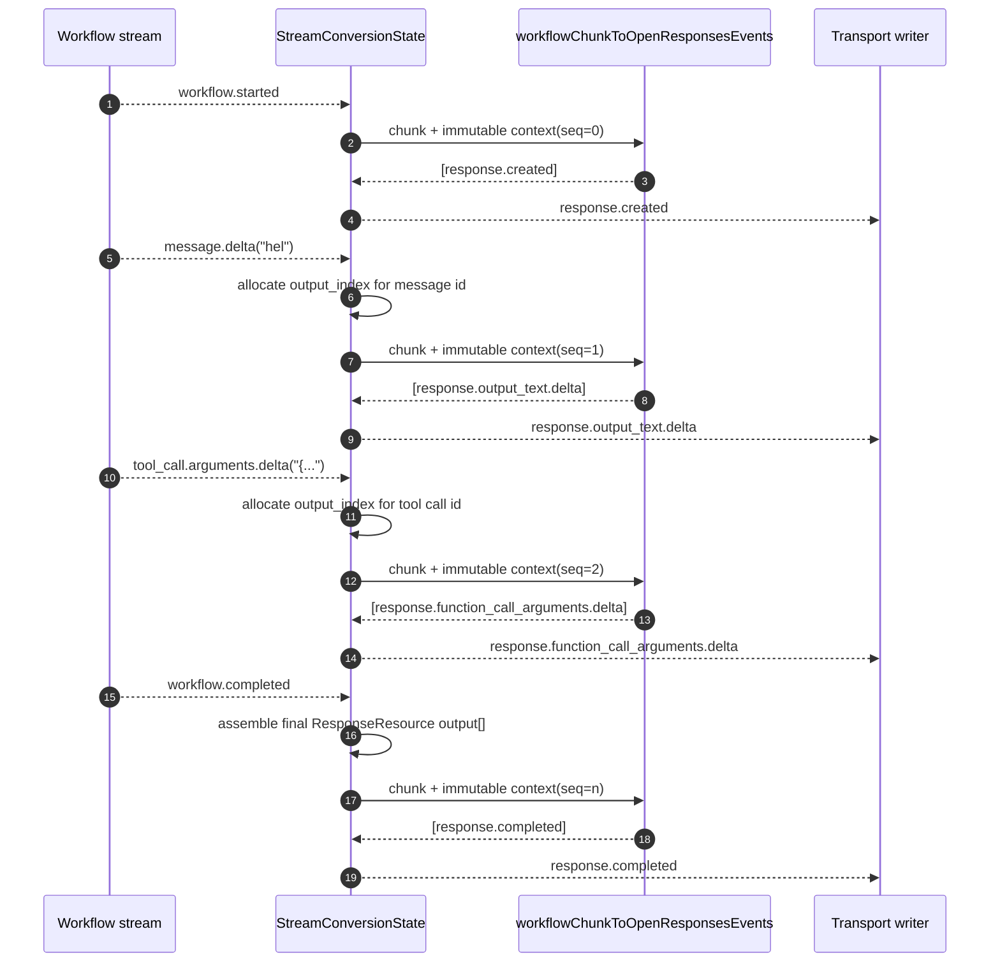

# Design: self-contained lazy-loaded workflow runtime

> **Status:** First draft
> **Date:** 2026-05-04
> **Scope:** Workflow layout, lazy loading, LangGraph chunk streaming, OpenResponses conversion, and the first `simple` workflow migration.
> **Deferred:** Open advisories
> [`isb-adv-0001`](../project-management/advisories/isb-adv-0001-error-message-leak.md)
> and
> [`isb-adv-0002`](../project-management/advisories/isb-adv-0002-reasoning-block-spec-gaps.md)
> remain deferred per user direction.

---

## 1. Problem statement

The repository is migrating away from `src/international-space-bar/`. The README marks that tree as migration-in-progress legacy code that will be deleted, so this design treats it as retired input and excludes it from future workflow plans.

Workflows need a new home that is independent from both the retiring tree and the NestJS server adapter:

- Workflows live in `src/international-space-bar-workflows/`.
- Workflows do not import interfaces, contracts, or shared types from sibling feature folders.
- Shared workflow interfaces live inside the workflow root itself.
- Every direct child folder under the workflow root is one workflow.
- A workflow may contain sub-workflows/sub-graphs inside its own folder.
- Agent skills are markdown files and must be part of workflow packaging.
- Workflows are lazy-loaded unless selected by the request.
- Each workflow chooses its own persistence/checkpointing method.
- OpenResponses conversion is reusable without NestJS.

The current `WorkflowResult` idea is too narrow for a graph runtime that streams messages, reasoning, tool calls, interrupts, metadata, errors, and future protocol shapes. The design keeps `WorkflowChunk` as the main contract and treats non-streaming results as an aggregation concern over the same chunks.

---

## 2. Design goals

1. Move active workflow ownership to `src/international-space-bar-workflows/`.
2. Keep workflow contracts self-contained inside that root.
3. Lazy-load workflows by model/workflow id.
4. Preserve a mandatory always-present `simple` workflow for smoke tests.
5. Model LangGraph stream cases broadly enough for current and future stream modes.
6. Decouple workflow streams from OpenResponses protocol conversion.
7. Decouple OpenResponses conversion from NestJS HTTP/SSE transport.
8. Support agent skill markdown files as first-class workflow assets.
9. Let each workflow decide persistence/checkpointing independently.

---

## 3. Non-goals

- No new dependency on `src/international-space-bar/`.
- No migration of every existing workflow in this first design.
- No NestJS decorators, modules, controllers, pipes, guards, or framework types in workflow or OpenResponses conversion packages.
- No hand-written duplicate of Kubb-generated OpenResponses schema types.
- No forced global persistence strategy for all workflows.

---

## 4. Proposed source layout

```text
src/
  international-space-bar-workflows/
    contracts/
      workflow-contracts.ts
      workflow-chunks.ts
      workflow-registry.ts
      workflow-assets.ts
      persistence.ts
    simple/
      index.ts
      simple.workflow.ts
      simple.graph.ts
      simple.persistence.ts
      skills/
        simple-agent.md
      README.md
    director/
      index.ts
      director.workflow.ts
      director.graph.ts
      subgraphs/
        planner/
          planner.graph.ts
          skills/
            planner.md
        reviewer/
          reviewer.graph.ts
          skills/
            reviewer.md

  international-space-bar-openresponses/
    contracts/
      openresponses-stream.ts
    conversion/
      workflow-chunk-to-openresponses.ts
      response-resource-builder.ts
      stream-state.ts
    generated-bridge/
      streaming-event-types.ts
    README.md

  international-space-bar-server/
    openresponses/
      responses.controller.ts
      responses.service.ts
      sse-writer.ts
    workflow-runtime/
      workflow-runtime.port.ts
      lazy-workflow-runtime.service.ts
```

### 4.1 Workflow root rules

| Location                                             | Rule                                                                                           |
| ---------------------------------------------------- | ---------------------------------------------------------------------------------------------- |
| `international-space-bar-workflows/contracts`        | Shared workflow-only contracts. May not import server contracts.                               |
| `international-space-bar-workflows/<name>`           | One workflow per direct child folder.                                                          |
| `international-space-bar-workflows/<name>/subgraphs` | Sub-workflows/sub-graphs owned by that workflow.                                               |
| `international-space-bar-workflows/<name>/skills`    | Markdown skills owned by that workflow or sub-workflow.                                        |
| `international-space-bar-openresponses`              | Protocol conversion. No NestJS imports.                                                        |
| `international-space-bar-server`                     | HTTP/WebSocket/SSE transport only. May import workflow runtime ports and conversion functions. |

### 4.2 Dependency direction

```text
NestJS server transport
  -> OpenResponses conversion package
  -> workflow runtime contracts
  -> selected lazy-loaded workflow

Workflow folders never import from:
  - src/international-space-bar/
  - src/international-space-bar-server/
  - src/international-space-bar-openresponses/

OpenResponses conversion imports:
  - workflow contracts
  - generated OpenResponses schema/types bridge

OpenResponses conversion never imports:
  - NestJS
  - Express
  - WebSocket gateway classes
  - workflow implementation folders
```

---

## 5. Workflow package contract

Each workflow folder exports one `WorkflowModule`. The module describes identity, lazy assets, persistence, and streaming execution.

```ts
// src/international-space-bar-workflows/contracts/workflow-contracts.ts
import type { BaseMessage } from "@langchain/core/messages";

export interface WorkflowRequest {
    readonly requestId: string;
    readonly workflowId: string;
    readonly model: string;
    readonly input: readonly BaseMessage[];
    readonly instructions?: string;
    readonly metadata?: Readonly<Record<string, unknown>>;
    readonly abortSignal?: AbortSignal;
}

export interface WorkflowModule {
    readonly manifest: WorkflowManifest;
    createRunner(context: WorkflowLoadContext): Promise<WorkflowRunner>;
}

export interface WorkflowManifest {
    readonly id: string;
    readonly models: readonly string[];
    readonly description: string;
    readonly skills: readonly WorkflowSkillAsset[];
    readonly persistence: WorkflowPersistenceDescriptor;
}

export interface WorkflowLoadContext {
    readonly logger: WorkflowLogger;
    readonly now: () => Date;
}

export interface WorkflowRunner {
    stream(request: WorkflowRequest): AsyncIterable<WorkflowChunk>;
}
```

The contract intentionally has no `invoke(): Promise<WorkflowResult>` requirement. A non-streaming HTTP response can be built by consuming `stream()` and reducing chunks into a final protocol response.

---

## 6. Agent skill markdown as workflow assets

Agent skills are markdown files, not TypeScript modules. The runtime should not bundle them accidentally by walking arbitrary paths at request time. Each workflow declares skill assets in its manifest, and the workflow loader reads those files only when that workflow is loaded.

```ts
// src/international-space-bar-workflows/contracts/workflow-assets.ts
export interface WorkflowSkillAsset {
    readonly id: string;
    readonly role: "system" | "agent" | "tool" | "subworkflow";
    readonly path: string;
    readonly required: boolean;
}

export interface LoadedWorkflowSkill {
    readonly id: string;
    readonly role: WorkflowSkillAsset["role"];
    readonly markdown: string;
}
```

Example manifest:

```ts
export const simpleManifest = {
    id: "simple",
    models: ["isb-simple"],
    description: "Always-present smoke-test workflow: START -> llm -> END.",
    skills: [
        {
            id: "simple-agent",
            role: "agent",
            path: new URL("./skills/simple-agent.md", import.meta.url).pathname,
            required: true,
        },
    ],
    persistence: { kind: "none" },
} satisfies WorkflowManifest;
```

Skill loading is part of `createRunner(...)`, not registry construction. That preserves lazy loading: if `isb-simple` is never selected, its skill markdown is never read.

---

## 7. Lazy-loaded workflow registry

The registry maps public model names to import factories. The values are functions, not modules, so workflow code and markdown assets are not loaded until selected.

```ts
// src/international-space-bar-workflows/contracts/workflow-registry.ts
export type WorkflowImport = () => Promise<{ default: WorkflowModule }>;

export interface WorkflowRegistryEntry {
    readonly workflowId: string;
    readonly models: readonly string[];
    readonly load: WorkflowImport;
}

export const workflowRegistry = [
    {
        workflowId: "simple",
        models: ["isb-simple"],
        load: () => import("../simple/index.js"),
    },
    {
        workflowId: "director",
        models: ["isb-director"],
        load: () => import("../director/index.js"),
    },
] satisfies readonly WorkflowRegistryEntry[];
```

The server asks a runtime service for the selected workflow. The service may cache loaded modules after the first import.

```ts
export class LazyWorkflowRuntime {
    private readonly loaded = new Map<string, Promise<WorkflowRunner>>();

    constructor(
        private readonly registry: readonly WorkflowRegistryEntry[],
        private readonly context: WorkflowLoadContext,
    ) {}

    async runnerForModel(model: string): Promise<WorkflowRunner> {
        const entry = this.registry.find((candidate) => candidate.models.includes(model));
        if (!entry) throw new UnknownWorkflowModelError(model);

        const cached = this.loaded.get(entry.workflowId);
        if (cached) return cached;

        const pending = entry
            .load()
            .then(({ default: module }) => module.createRunner(this.context));
        this.loaded.set(entry.workflowId, pending);
        return pending;
    }
}
```

---

## 8. `WorkflowChunk` as the stable workflow stream

`WorkflowChunk` is the protocol-neutral stream emitted by workflows. It needs to cover LangGraph's graph state streams, LLM tokens, events, custom data, task/checkpoint events, tool progress, metadata, errors, and subgraph namespacing.

LangGraph's streaming documentation lists `values`, `updates`, `custom`, `messages`, and `debug` stream modes, and documents `.streamEvents(...)` as the event stream for internal node/model/tool events. The LangGraph SDK stream type also includes `events`, `tasks`, `checkpoints`, `messages-tuple`, `tools`, plus metadata/error/feedback events.

```ts
// src/international-space-bar-workflows/contracts/workflow-chunks.ts
export type WorkflowChunk =
    | WorkflowLifecycleChunk
    | WorkflowMessageChunk
    | WorkflowReasoningChunk
    | WorkflowToolCallChunk
    | WorkflowToolProgressChunk
    | WorkflowStateChunk
    | WorkflowCustomChunk
    | WorkflowTaskChunk
    | WorkflowCheckpointChunk
    | WorkflowMetadataChunk
    | WorkflowErrorChunk;

export interface WorkflowChunkBase {
    readonly workflowId: string;
    readonly runId: string;
    readonly node?: string;
    readonly subgraphPath?: readonly string[];
    readonly sequence?: number;
    readonly raw?: unknown;
}

export interface WorkflowLifecycleChunk extends WorkflowChunkBase {
    readonly type: "workflow.started" | "workflow.completed" | "workflow.incomplete";
}

export interface WorkflowMessageChunk extends WorkflowChunkBase {
    readonly type: "message.start" | "message.delta" | "message.done";
    readonly messageId: string;
    readonly role: "assistant" | "user" | "system" | "developer" | "tool";
    readonly delta?: string;
    readonly text?: string;
}

export interface WorkflowReasoningChunk extends WorkflowChunkBase {
    readonly type: "reasoning.start" | "reasoning.delta" | "reasoning.done";
    readonly reasoningId: string;
    readonly summaryIndex: number;
    readonly delta?: string;
    readonly text?: string;
}

export interface WorkflowToolCallChunk extends WorkflowChunkBase {
    readonly type: "tool_call.start" | "tool_call.arguments.delta" | "tool_call.arguments.done";
    readonly callId: string;
    readonly name: string;
    readonly delta?: string;
    readonly argumentsText?: string;
}

export interface WorkflowToolProgressChunk extends WorkflowChunkBase {
    readonly type: "tool.progress";
    readonly callId?: string;
    readonly name: string;
    readonly state: "starting" | "running" | "completed" | "error";
    readonly data?: unknown;
}

export interface WorkflowStateChunk extends WorkflowChunkBase {
    readonly type: "state.values" | "state.updates" | "state.debug";
    readonly data: unknown;
}

export interface WorkflowCustomChunk extends WorkflowChunkBase {
    readonly type: "custom";
    readonly data: unknown;
}

export interface WorkflowTaskChunk extends WorkflowChunkBase {
    readonly type: "task";
    readonly data: unknown;
}

export interface WorkflowCheckpointChunk extends WorkflowChunkBase {
    readonly type: "checkpoint";
    readonly data: unknown;
}

export interface WorkflowMetadataChunk extends WorkflowChunkBase {
    readonly type: "metadata" | "feedback";
    readonly data: unknown;
}

export interface WorkflowErrorChunk extends WorkflowChunkBase {
    readonly type: "error";
    readonly code: string;
    readonly safeMessage: string;
    readonly cause?: unknown;
}
```

### 8.1 Why `WorkflowResult` is not the primary contract

A graph can stream several output items and state transitions before it reaches a terminal condition. Compressing that into a single `WorkflowResult` risks dropping reasoning, tool calls, subgraph activity, task interrupts, checkpoint metadata, and future OpenResponses event families.

The replacement rule:

```ts
// streaming path
workflow.stream(request): AsyncIterable<WorkflowChunk>;

// non-streaming path
reduceWorkflowChunksToResponse(workflow.stream(request));
```

A small final result type may still exist internally as an aggregation result, but it is derived from chunks and never constrains what workflows can emit.

---

## 9. `langGraphChunks` adapter

`langGraphChunks` converts one compiled LangGraph stream into `WorkflowChunk` values. It lives in the workflow root contracts/adapters area, not inside OpenResponses and not inside NestJS.

### 9.1 Sequence diagram



### 9.2 `langGraphChunks` API

```ts
export interface LangGraphChunksOptions {
    readonly workflowId: string;
    readonly runId: string;
    readonly streamMode?: readonly LangGraphStreamMode[];
    readonly abortSignal?: AbortSignal;
}

export type LangGraphStreamMode =
    | "values"
    | "updates"
    | "messages"
    | "messages-tuple"
    | "custom"
    | "events"
    | "debug"
    | "tasks"
    | "checkpoints"
    | "tools";

export interface StreamableLangGraph {
    streamEvents(input: unknown, options: Record<string, unknown>): AsyncIterable<LangGraphEvent>;
}

export async function* langGraphChunks(
    graph: StreamableLangGraph,
    input: unknown,
    options: LangGraphChunksOptions,
): AsyncGenerator<WorkflowChunk> {
    yield {
        type: "workflow.started",
        workflowId: options.workflowId,
        runId: options.runId,
    };

    for await (const event of graph.streamEvents(input, {
        version: "v2",
        signal: options.abortSignal,
        streamMode: options.streamMode ?? ["values", "messages-tuple", "events", "custom"],
    })) {
        yield* langGraphEventToWorkflowChunks(event, options);
    }

    yield {
        type: options.abortSignal?.aborted ? "workflow.incomplete" : "workflow.completed",
        workflowId: options.workflowId,
        runId: options.runId,
    };
}
```

### 9.3 Pure event conversion function

The conversion is a pure function: one LangGraph event plus immutable context in, zero or more `WorkflowChunk` values out. It performs classification only; it does not write SSE frames, mutate HTTP responses, or import OpenResponses types.

```ts
export function langGraphEventToWorkflowChunks(
    event: LangGraphEvent,
    context: Pick<LangGraphChunksOptions, "workflowId" | "runId">,
): readonly WorkflowChunk[] {
    const base = {
        workflowId: context.workflowId,
        runId: context.runId,
        node: langGraphNode(event),
        subgraphPath: langGraphSubgraphPath(event),
        raw: event,
    } as const;

    if (event.event === "on_chat_model_stream") {
        const chunk = chatModelChunk(event.data);

        if (chunk.toolCallChunk) {
            return [
                {
                    ...base,
                    type: "tool_call.arguments.delta",
                    callId: chunk.toolCallChunk.id,
                    name: chunk.toolCallChunk.name,
                    delta: chunk.toolCallChunk.args,
                },
            ];
        }

        if (chunk.reasoningText) {
            return [
                {
                    ...base,
                    type: "reasoning.delta",
                    reasoningId: chunk.messageId,
                    summaryIndex: 0,
                    delta: chunk.reasoningText,
                },
            ];
        }

        if (chunk.contentText) {
            return [
                {
                    ...base,
                    type: "message.delta",
                    messageId: chunk.messageId,
                    role: "assistant",
                    delta: chunk.contentText,
                },
            ];
        }
    }

    if (event.event === "on_tool_start") {
        return [
            {
                ...base,
                type: "tool.progress",
                name: event.name,
                state: "starting",
                data: event.data,
            },
        ];
    }

    if (event.event === "on_tool_end") {
        return [
            {
                ...base,
                type: "tool.progress",
                name: event.name,
                state: "completed",
                data: event.data,
            },
        ];
    }

    return [{ ...base, type: "state.debug", data: event }];
}
```

### 9.4 Event-to-chunk mapping

| LangGraph source case                    | Workflow chunk output                                                                                  |
| ---------------------------------------- | ------------------------------------------------------------------------------------------------------ |
| `on_chat_model_start`                    | `message.start`, `reasoning.start`, or `tool_call.start` once the first chunk identifies the item kind |
| `on_chat_model_stream` text content      | `message.delta`                                                                                        |
| `on_chat_model_stream` reasoning content | `reasoning.delta`                                                                                      |
| `on_chat_model_stream` tool call chunk   | `tool_call.arguments.delta`                                                                            |
| `on_chat_model_end`                      | `message.done`, `reasoning.done`, or `tool_call.arguments.done` for the open item                      |
| `on_tool_start` / `on_tool_end` / errors | `tool.progress`                                                                                        |
| `values` stream mode                     | `state.values`                                                                                         |
| `updates` stream mode                    | `state.updates`                                                                                        |
| `custom` stream mode                     | `custom`                                                                                               |
| `debug` stream mode                      | `state.debug`                                                                                          |
| `tasks` stream mode                      | `task`                                                                                                 |
| `checkpoints` stream mode                | `checkpoint`                                                                                           |
| `tools` stream mode                      | `tool.progress`                                                                                        |
| metadata/error/feedback events           | `metadata`, `error`, `feedback`                                                                        |
| subgraph-prefixed events                 | Same chunk type with `subgraphPath` populated                                                          |

### 9.5 Concurrent queue detail

`langGraphChunks` may need queues when one logical OpenResponses item spans multiple LangGraph events. The producer keeps consuming LangGraph events while item-specific async generators emit deltas downstream. This preserves real-time streaming and avoids the deadlock documented in `docs/designs/isb-langgraph-streaming-refactor.md`.



---

## 10. Simple workflow migration

The first workflow to migrate is `simple`. It must always be present and should remain suitable for basic smoke testing.

### 10.1 Required graph shape



### 10.2 Draft implementation shape

```ts
// src/international-space-bar-workflows/simple/simple.graph.ts
import { MessagesValue, StateGraph, StateSchema, START, END } from "@langchain/langgraph";
import { z } from "zod";

const SimpleState = new StateSchema({
    messages: MessagesValue,
});

const SimpleContext = z.object({
    runId: z.string(),
});

export function buildSimpleGraph(llm: SimpleChatModel) {
    return new StateGraph(SimpleState, { context: SimpleContext })
        .addNode("llm", async (state) => {
            const response = await llm.invoke(state.messages);
            return { messages: [response] };
        })
        .addEdge(START, "llm")
        .addEdge("llm", END)
        .compile();
}
```

```ts
// src/international-space-bar-workflows/simple/simple.workflow.ts
export async function createSimpleRunner(context: WorkflowLoadContext): Promise<WorkflowRunner> {
    const skills = await loadWorkflowSkills(simpleManifest.skills);
    const llm = createSimpleSmokeTestModel({ skills, logger: context.logger });
    const graph = buildSimpleGraph(llm);

    return {
        stream(request) {
            return langGraphChunks(
                graph,
                { messages: request.input },
                {
                    workflowId: simpleManifest.id,
                    runId: request.requestId,
                    abortSignal: request.abortSignal,
                },
            );
        },
    };
}
```

The simple workflow chooses `persistence: { kind: "none" }` for smoke testing. Other workflows can choose memory, file, database, or remote checkpointers in their own manifests.

---

## 11. Workflow-owned persistence

Persistence is not global. Each workflow declares and constructs its own persistence during `createRunner(...)`.

```ts
export type WorkflowPersistenceDescriptor =
    | { readonly kind: "none" }
    | { readonly kind: "memory"; readonly namespace: string }
    | { readonly kind: "file"; readonly directory: string }
    | { readonly kind: "database"; readonly connectionName: string }
    | { readonly kind: "custom"; readonly description: string };
```

```ts
export async function createDirectorRunner(context: WorkflowLoadContext): Promise<WorkflowRunner> {
    const checkpointer = await createDirectorCheckpointer({
        persistence: directorManifest.persistence,
        logger: context.logger,
    });

    const graph = buildDirectorGraph({ checkpointer });

    return {
        stream(request) {
            return langGraphChunks(graph, directorInput(request), {
                workflowId: directorManifest.id,
                runId: request.requestId,
                abortSignal: request.abortSignal,
            });
        },
    };
}
```

This lets a stateless smoke-test workflow remain lightweight while stateful workflows opt into checkpointing, stores, or workflow-specific durability.

---

## 12. Decoupling graph streams from OpenResponses streams

The workflow layer emits `WorkflowChunk`. It does not emit OpenResponses events. The OpenResponses conversion layer receives `WorkflowChunk` values and emits generated OpenResponses streaming event types.

```text
LangGraph event
  -> langGraphChunks
  -> WorkflowChunk
  -> workflowChunkToOpenResponsesEvents
  -> ResponseCreated / OutputTextDelta / ReasoningSummaryDelta / FunctionCallArgumentsDelta / ...
  -> NestJS SSE writer or WebSocket writer
```

### 12.1 Independent OpenResponses conversion package

`src/international-space-bar-openresponses/` owns protocol conversion. It is framework-free and reusable by HTTP, WebSocket, tests, CLI tools, or future transports.

```ts
// src/international-space-bar-openresponses/contracts/openresponses-stream.ts
import type { ResponseStreamEvent } from "../generated-bridge/streaming-event-types.js";
import type { WorkflowChunk } from "../../international-space-bar-workflows/contracts/workflow-chunks.js";

export interface OpenResponsesConversionContext {
    readonly responseId: string;
    readonly createdAt: number;
    readonly model: string;
    readonly sequence: number;
}

export type OpenResponsesConversionResult = readonly ResponseStreamEvent[];

export function workflowChunkToOpenResponsesEvents(
    chunk: WorkflowChunk,
    context: OpenResponsesConversionContext,
): OpenResponsesConversionResult;
```

`ResponseStreamEvent` should be a union over Kubb-generated event types instead of a duplicate hand-rolled shape.

```ts
// src/international-space-bar-openresponses/generated-bridge/streaming-event-types.ts
export type ResponseStreamEvent =
    | ResponseCreatedStreamingEvent
    | ResponseOutputItemAddedStreamingEvent
    | ResponseOutputTextDeltaStreamingEvent
    | ResponseOutputTextDoneStreamingEvent
    | ResponseReasoningSummaryPartAddedStreamingEvent
    | ResponseReasoningSummaryDeltaStreamingEvent
    | ResponseReasoningSummaryDoneStreamingEvent
    | ResponseReasoningSummaryPartDoneStreamingEvent
    | ResponseFunctionCallArgumentsDeltaStreamingEvent
    | ResponseFunctionCallArgumentsDoneStreamingEvent
    | ResponseOutputItemDoneStreamingEvent
    | ResponseCompletedStreamingEvent
    | ResponseIncompleteStreamingEvent
    | ResponseFailedStreamingEvent;
```

### 12.2 Pure OpenResponses conversion function

The converter is pure: it receives a chunk and immutable conversion state, and returns protocol events. A separate reducer owns mutable counters and response assembly.

```ts
export function workflowChunkToOpenResponsesEvents(
    chunk: WorkflowChunk,
    context: OpenResponsesConversionContext,
): readonly ResponseStreamEvent[] {
    if (chunk.type === "workflow.started") {
        return [
            responseCreatedStreamingEventSchema.parse({
                type: "response.created",
                sequence_number: context.sequence,
                response: createInProgressResponse(context),
            }),
        ];
    }

    if (chunk.type === "message.delta") {
        return [
            responseOutputTextDeltaStreamingEventSchema.parse({
                type: "response.output_text.delta",
                sequence_number: context.sequence,
                item_id: chunk.messageId,
                output_index: outputIndexFor(chunk.messageId),
                content_index: 0,
                delta: chunk.delta ?? "",
            }),
        ];
    }

    if (chunk.type === "reasoning.delta") {
        return [
            responseReasoningSummaryDeltaStreamingEventSchema.parse({
                type: "response.reasoning_summary_text.delta",
                sequence_number: context.sequence,
                item_id: chunk.reasoningId,
                output_index: outputIndexFor(chunk.reasoningId),
                summary_index: chunk.summaryIndex,
                delta: chunk.delta ?? "",
            }),
        ];
    }

    if (chunk.type === "tool_call.arguments.delta") {
        return [
            responseFunctionCallArgumentsDeltaStreamingEventSchema.parse({
                type: "response.function_call_arguments.delta",
                sequence_number: context.sequence,
                item_id: chunk.callId,
                output_index: outputIndexFor(chunk.callId),
                delta: chunk.delta ?? "",
            }),
        ];
    }

    if (chunk.type === "workflow.completed") {
        return [
            responseCompletedStreamingEventSchema.parse({
                type: "response.completed",
                sequence_number: context.sequence,
                response: createCompletedResponse(context),
            }),
        ];
    }

    return [];
}
```

`outputIndexFor(...)`, `createInProgressResponse(...)`, and `createCompletedResponse(...)` are shown as collaborators. In implementation they should live in a `StreamConversionState` reducer so the pure per-chunk function remains deterministic and easy to test.

### 12.3 Conversion sequence diagram



---

## 13. Server integration

The NestJS server remains a transport adapter. It validates requests, authenticates clients, obtains a workflow runner, pipes chunks through OpenResponses conversion, and writes SSE/WebSocket frames.

```ts
async *createOpenResponsesStream(body: CreateResponseBody): AsyncIterable<ResponseStreamEvent> {
    const runner = await this.workflowRuntime.runnerForModel(body.model);
    const workflowChunks = runner.stream(toWorkflowRequest(body));

    yield* convertWorkflowChunksToOpenResponses(workflowChunks, {
        responseId: createResponseId(),
        model: body.model,
        createdAt: Math.floor(Date.now() / 1000),
    });
}
```

The controller does not know LangGraph exists. The workflow runner does not know OpenResponses exists. The converter does not know NestJS exists.

---

## 14. Migration steps

1. Create `src/international-space-bar-workflows/contracts/`.
2. Create `src/international-space-bar-workflows/simple/` with `START -> llm -> END` graph.
3. Add `simple/skills/simple-agent.md` and manifest-based skill loading.
4. Create lazy workflow registry with `isb-simple` always registered.
5. Create `langGraphChunks` adapter and pure event classification tests.
6. Create `src/international-space-bar-openresponses/` conversion package.
7. Move OpenResponses conversion logic out of NestJS-owned files.
8. Wire server runtime to lazy workflow runtime.
9. Keep existing server-generated OpenResponses schemas as the type source; do not duplicate schema types.
10. Retire old simple workflow references after the new `simple` workflow is active.

---

## 15. Validation plan

| Area                     | Validation                                                                                         |
| ------------------------ | -------------------------------------------------------------------------------------------------- |
| Lazy loading             | Unit test verifies only selected workflow import factory is called.                                |
| Skill markdown           | Unit test verifies required skill markdown is read during selected workflow load.                  |
| Simple workflow          | Smoke test streams `isb-simple` through `START -> llm -> END`.                                     |
| LangGraph chunks         | Fixture events cover text, reasoning, tool calls, custom, errors, checkpoints, and subgraph paths. |
| OpenResponses conversion | Pure-function tests assert chunks become generated OpenResponses events.                           |
| NestJS decoupling        | Import-boundary test or lint rule rejects NestJS imports in workflows/conversion packages.         |
| Persistence ownership    | Unit test verifies workflow manifest controls selected checkpointer.                               |

---

## 16. Open questions for the next draft

1. Should the OpenResponses package be named exactly `src/international-space-bar-openresponses/`, or should it live under another top-level `src/` name?
2. Should `simple` use a deterministic fake model for smoke tests, or a configured real LLM with a deterministic fallback?
3. Which persistence backends should be implemented first after `none` and `memory`?
4. Should workflow manifests be TypeScript-only, or should they also have a generated JSON index for tooling?

---

## 17. References

- README migration note: `README.md` lines 199-229 in this repository.
- Existing streaming design: `docs/response-stream-builder.md` and `docs/designs/isb-langgraph-streaming-refactor.md`.
- Historical simple workflow reference only, not a future dependency: `src/international-space-bar-server/graphs/simple-workflow.graph.ts`.
- Historical LangGraph adapter reference only, not a future dependency: `src/international-space-bar-server/openresponses/lang-graph-blocks.ts`.
- LangGraph streaming docs fetched from source and verified during this draft: <https://raw.githubusercontent.com/langchain-ai/langgraphjs/main/docs/docs/concepts/streaming.md>.
- LangGraph SDK stream mode type fetched from source commit `740ce21852b1cc84e9210294f1851624e9d51cfe` and verified during this draft: <https://github.com/langchain-ai/langgraphjs/blob/740ce21852b1cc84e9210294f1851624e9d51cfe/libs/sdk/src/types.stream.ts>.
- OpenResponses generated streaming event types directory: `src/international-space-bar-server/openresponses/generated/types/`.
  Specific generated types referenced by examples include:
    - `ResponseCreatedStreamingEvent.ts`
    - `ResponseOutputTextDeltaStreamingEvent.ts`
    - `ResponseReasoningSummaryDeltaStreamingEvent.ts`
    - `ResponseFunctionCallArgumentsDeltaStreamingEvent.ts`
    - `ResponseCompletedStreamingEvent.ts`
