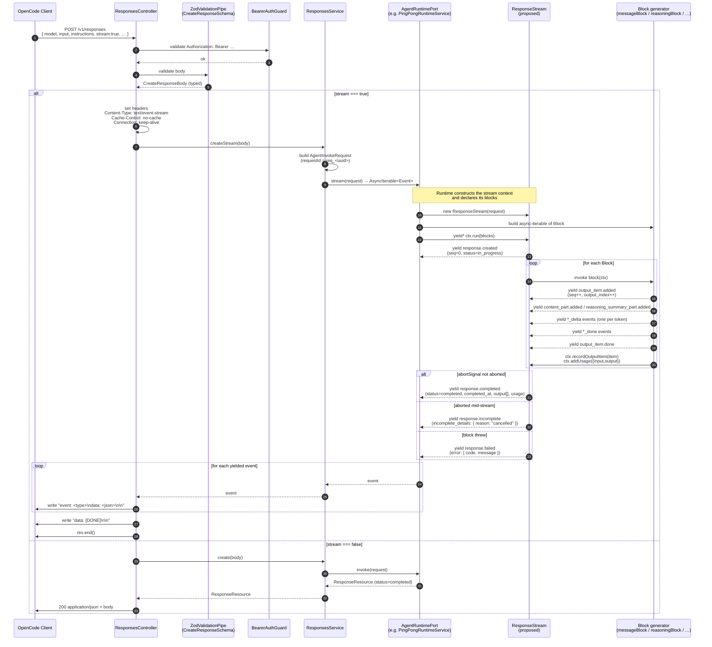

# Response Stream Builder — Architecture & Design Document

> **Status**: Design — not yet implemented
>
> **Reference spec**: [OpenResponses Specification](https://www.openresponses.org/specification)
>
> **Orchestration framework**: [LangGraph (JS)](https://docs.langchain.com/oss/javascript/langgraph) — single, mandatory orchestration layer for every runtime (see §3 and §10)
>
> **Related docs**: [websocket-transport.md](./websocket-transport.md), [openresponses-backend-phased-design.md](./openresponses-backend-phased-design.md), [agent-validation-pipeline.md](./agent-validation-pipeline.md)
>
> **Reference style**: every external claim in this document is hyperlinked to a fetched-at-write-time primary source per the academic-reference principle in [AGENTS.md](../AGENTS.md#general-principles). The full citation list is in §12.

---

## 1. Problem Statement

The current streaming implementation in `PingPongRuntimeService.stream()` and its sibling `streamSimplePong()` hand-builds every `ResponseStreamEvent` inline. Each event is a fully-spelled-out object passed through `someEventSchema.parse()` with sequence numbers, output indices, item ids, timestamps, and the entire `ResponseResource` envelope duplicated between the two code paths.

This produces three concrete problems:

1. **Boilerplate at every yield site.** A single "emit a `pong` text" requires ~80 lines: build `inProgressResponse` (32 fields), yield `response.created`, yield `output_item.added`, yield `content_part.added`, yield `output_text.delta`, yield `output_text.done`, yield `content_part.done`, yield `output_item.done`, yield `response.completed`. Sequence numbers, output indices, item ids are threaded by hand.

2. **Duplicated `ResponseResource` construction.** `streamSimplePong` and the Ollama path each build their own `inProgressResponse` from scratch with hardcoded values for `temperature`, `top_p`, `tools`, `metadata`, and 25 other fields. Most of those fields should be echoed from the request, but the request itself (`AgentInvokeRequest`) is too thin to carry them.

3. **Static, non-composable flows.** The full Ollama path expresses its sequence as a hardcoded series of `yield* streamReasoningBlock(...)` / `yield* streamMessageBlock(...)` calls with manually-counted `outputIndex` values (`0, 1, 2, 3, 4, 5`). This breaks the moment a flow becomes dynamic — e.g. "only call the tool if reasoning suggests it", or "reason → message → tool → reason → tool → reason → message → ask-user", where each block's existence depends on the previous block's result.

The goal is a class-based abstraction where the runtime declares **what** the response is (a list — possibly dynamic — of semantic blocks), and the class handles **how** to emit a protocol-compliant stream.

---

## 2. Request Flow — HTTP / SSE

### 2.1 Sequence diagram (non-WebSocket path)



### 2.2 Step-by-step narrative (streaming path)

1. **Client → Controller.** OpenCode posts a JSON body to `/v1/responses` with `Authorization: Bearer <token>` and `stream: true`.
2. **Auth + validation.** `BearerAuthGuard` does timing-safe token comparison. `ZodValidationPipe(CreateResponseSchema)` parses the body into a typed `CreateResponseBody`.
3. **Branch on `stream`.** If `stream === true`, the controller sets SSE headers and invokes `responses.createStream(body)`. Otherwise it returns JSON via `responses.create(body)`.
4. **Service builds request.** `ResponsesService.createStream` flattens `body.input` (string or array) and constructs `AgentInvokeRequest` with a fresh `requestId`. _(In the proposed design, the service must also pass the full echo-config — see §6.)_
5. **Runtime opens stream.** The injected `AgentRuntimePort` (currently `PingPongRuntimeService`) returns an `AsyncIterable<ResponseStreamEvent>`.
6. **Stream context constructed.** _(Proposed)_ The runtime instantiates `new ResponseStream(request)` and declares its blocks — either as a static array (e.g. `[messageBlock("pong")]`) or as an `async function*` that decides blocks dynamically. It then `yield*`s `ctx.run(blocks)`.
7. **`ctx.run` orchestrates.** The class yields `response.created`, then iterates the blocks. Each block yields its protocol events while reporting its final output item and usage back to `ctx`. The class emits the terminal event (`completed` / `incomplete` / `failed`) based on observed state.
8. **Controller writes SSE frames.** For each event yielded, the controller writes `event: <type>\ndata: <json>\n\n` to the response stream, then writes the `[DONE]` sentinel and ends the response.

---

## 3. Architecture

### 3.1 Component model

The codebase owns three layers — protocol, adapter, and the runtime that wires a [LangGraph](https://docs.langchain.com/oss/javascript/langgraph) [`CompiledStateGraph`](https://reference.langchain.com/javascript/langchain-langgraph/index/CompiledStateGraph) to the protocol layer. The agent orchestration layer (LangGraph itself) is an external dependency, not something we re-implement.

```
┌────────────────────────────────────────────────────────────────┐
│  ResponsesController       (HTTP entry, SSE framing)           │
│  ResponsesGateway          (WebSocket entry, JSON framing)     │
└──────────────────────────┬─────────────────────────────────────┘
                           │ AsyncIterable<ResponseStreamEvent>
┌──────────────────────────▼─────────────────────────────────────┐
│  ResponsesService                                              │
│   • flattens input                                             │
│   • assembles AgentInvokeRequest (with full echo-config)       │
└──────────────────────────┬─────────────────────────────────────┘
                           │
┌──────────────────────────▼─────────────────────────────────────┐
│  AgentRuntimePort (interface)                                  │
│                                                                │
│   stream() responsibility — the ONLY supported shape:          │
│     1. build / fetch a CompiledStateGraph (LangGraph)          │
│     2. const ctx = new ResponseStream(request)                 │
│     3. yield* ctx.run(langGraphBlocks(graph, input))           │
│                                                                │
│   No runtime emits blocks by hand in production. A plain LLM   │
│   call is wrapped in a trivial graph (start → llm → end) so    │
│   that every runtime exposes the same LangGraph event surface  │
│   to the adapter. See §3.4.                                    │
└──────────────────────────┬─────────────────────────────────────┘
                           │
┌──────────────────────────▼─────────────────────────────────────┐
│  Adapter layer  (one adapter per upstream framework)           │
│                                                                │
│   • langGraphBlocks(graph, input)  ← canonical, only one in    │
│                                       this codebase            │
│                                                                │
│   Subscribes to graph.streamEvents(input, { version: "v2" })   │
│   and translates each event into a Block. Mapping table in §10.│
│   Reference: https://reference.langchain.com/javascript/       │
│              langchain-langgraph/index/CompiledStateGraph/     │
│              streamEvents                                      │
└──────────────────────────┬─────────────────────────────────────┘
                           │ AsyncIterable<Block>
┌──────────────────────────▼─────────────────────────────────────┐
│  ResponseStream  (owns protocol concerns)                      │
│   • State: seq, respId, now, request config, outputIndex,      │
│            output[], usage, error, incomplete_details, status  │
│   • Event methods: responseCreated, outputItemAdded,           │
│            contentPartAdded, textDelta, textDone, …            │
│   • run(blocks): wraps in created/completed                    │
│   • recordOutputItem(item), addUsage(delta), nextOutputIndex() │
└──────────────────────────┬─────────────────────────────────────┘
                           │ each Block emits
┌──────────────────────────▼─────────────────────────────────────┐
│  Block primitives (small library — emit protocol events)       │
│   type Block = (ctx) => AsyncIterable<ResponseStreamEvent>     │
│                                                                │
│   • messageBlock        — output_text item                     │
│   • reasoningBlock      — reasoning summary item               │
│   • functionCallBlock   — function_call item                   │
│   • compactionBlock     (future)                               │
│                                                                │
│   These are produced ONLY by the LangGraph adapter, and        │
│   (transitionally, for unit tests) by hand. There is no        │
│   runtime in production that hand-builds block lists.          │
└────────────────────────────────────────────────────────────────┘
                           │
                           │ external — not in our codebase
                           ▼
┌────────────────────────────────────────────────────────────────┐
│  LangGraph orchestration  (https://docs.langchain.com/oss/     │
│                            javascript/langgraph)               │
│   • StateGraph nodes, edges, state, conditional routing        │
│   • Tool execution via prebuilt ToolNode                       │
│   • DeepAgents-style hierarchies are themselves LangGraphs     │
│   • LLMs are nodes; raw ChatOllama is wrapped per §3.4         │
└────────────────────────────────────────────────────────────────┘
```

### 3.4 The "always a graph" rule

A LangGraph compiled graph is the **only** input shape the protocol layer's adapter accepts. This includes the trivial case of a single LLM call:

```ts
// Even a one-shot ChatOllama invocation is wrapped:
import { StateGraph, START, END, MessagesValue } from "@langchain/langgraph";
import { ChatOllama } from "@langchain/ollama";

const llm = new ChatOllama({ model: "gemma3:e4b", baseUrl: ... });

const graph = new StateGraph({ channels: { messages: MessagesValue } })
    .addNode("llm", async (state) => ({ messages: [await llm.invoke(state.messages)] }))
    .addEdge(START, "llm")
    .addEdge("llm", END)
    .compile();
```

Why this rule exists:

1. **One event surface.** The adapter only ever consumes [`graph.streamEvents`](https://reference.langchain.com/javascript/langchain-langgraph/index/CompiledStateGraph/streamEvents) output. There is no second code path for "raw LLM" or "DeepAgents" — both are graphs.
2. **One library to learn.** Developers focus on LangGraph events. They don't switch mental models when they swap a single-LLM agent for a multi-agent system.
3. **No protocol-layer state machine.** The chunk-classification work that earlier drafts of this design attempted to put in the protocol layer (see §11.2) is already done by LangGraph and exposed as typed events. Re-implementing it would have been duplicate work and would have coupled the protocol layer to model-specific quirks.
4. **DeepAgents and similar are already LangGraphs.** [DeepAgents](https://github.com/langchain-ai/deepagents) is built on LangGraph; multi-agent hierarchies compile to a `CompiledStateGraph`. The same adapter handles them.

A `wrapAsGraph(llm)` helper lives next to the adapter to make the trivial case ergonomic. It is not a new abstraction — it's a one-function shortcut to the standard LangGraph pattern above. References: [`StateGraph` reference](https://reference.langchain.com/javascript/langchain-langgraph/index/StateGraph), [LangGraph state primitives](https://docs.langchain.com/oss/javascript/langgraph/use-graph-api).

### 3.2 Core types

```ts
class ResponseStream {
    constructor(request: AgentInvokeRequest);

    // Single entry point. Wraps blocks in response.created / response.completed.
    // Iterates blocks, increments outputIndex per block, emits terminal event.
    run(blocks: Iterable<Block> | AsyncIterable<Block>): AsyncIterable<ResponseStreamEvent>;

    // Event methods — used by blocks. Auto-fill seq, item shape parsing, etc.
    responseCreated(): ResponseStreamEvent;
    outputItemAdded(item: ItemField): ResponseStreamEvent;
    contentPartAdded(itemId: string, contentIndex: number, part: ContentPart): ResponseStreamEvent;
    textDelta(itemId: string, contentIndex: number, delta: string): ResponseStreamEvent;
    textDone(itemId: string, contentIndex: number, text: string): ResponseStreamEvent;
    contentPartDone(itemId: string, contentIndex: number, part: ContentPart): ResponseStreamEvent;
    outputItemDone(item: ItemField): ResponseStreamEvent;
    reasoningSummaryPartAdded(
        itemId: string,
        summaryIndex: number,
        part: SummaryPart,
    ): ResponseStreamEvent;
    reasoningSummaryDelta(itemId: string, summaryIndex: number, delta: string): ResponseStreamEvent;
    reasoningSummaryDone(itemId: string, summaryIndex: number, text: string): ResponseStreamEvent;
    reasoningSummaryPartDone(
        itemId: string,
        summaryIndex: number,
        part: SummaryPart,
    ): ResponseStreamEvent;
    functionCallArgumentsDelta(itemId: string, delta: string): ResponseStreamEvent;
    functionCallArgumentsDone(itemId: string, args: string): ResponseStreamEvent;
    // …terminal events emitted internally by run() based on accumulated state

    // Block ↔ context callbacks
    recordOutputItem(item: ItemField): void; // appended to response.output
    addUsage(delta: Partial<Usage>): void; // accumulated on response.usage
    readonly outputIndex: number; // current block's output_index
    readonly abortSignal: AbortSignal | undefined;
}

type Block = (ctx: ResponseStream) => AsyncIterable<ResponseStreamEvent>;
```

### 3.3 Example usage

Every runtime, regardless of complexity, looks like this:

```ts
// 1. Build (or fetch) a LangGraph compiled state graph.
//    https://reference.langchain.com/javascript/langchain-langgraph/index/CompiledStateGraph
const graph = buildAgentGraph();   // returns CompiledStateGraph

// 2. Stream protocol events — the standard shape:
async *stream(request: AgentInvokeRequest): AsyncIterable<ResponseStreamEvent> {
    const ctx = new ResponseStream(request);
    const messages = toBaseMessages(request.input);
    yield* ctx.run(langGraphBlocks(graph, { messages }));
}
```

Trivial single-LLM case (the one that replaces today's `_old`):

```ts
import { StateGraph, START, END, MessagesValue } from "@langchain/langgraph";
import { ChatOllama } from "@langchain/ollama";

const llm = new ChatOllama({ model: "gemma3:e4b", baseUrl: process.env.OLLAMA_BASE_URL });

const graph = new StateGraph({ channels: { messages: MessagesValue } })
    .addNode("llm", async (state) => ({ messages: [await llm.invoke(state.messages)] }))
    .addEdge(START, "llm")
    .addEdge("llm", END)
    .compile();

async *stream(request: AgentInvokeRequest): AsyncIterable<ResponseStreamEvent> {
    const ctx = new ResponseStream(request);
    yield* ctx.run(langGraphBlocks(graph, { messages: toBaseMessages(request.input) }));
}
```

ReAct-style agent with tools (still the same shape):

```ts
import { createReactAgent } from "@langchain/langgraph/prebuilt";

const graph = createReactAgent({ llm, tools: [weatherTool, shellTool] });

async *stream(request: AgentInvokeRequest): AsyncIterable<ResponseStreamEvent> {
    const ctx = new ResponseStream(request);
    yield* ctx.run(langGraphBlocks(graph, { messages: toBaseMessages(request.input) }));
}
```

Reference: [`createReactAgent`](https://reference.langchain.com/javascript/langchain-langgraph/prebuilt/createReactAgent).

The controller / gateway loop is unchanged:

```ts
for await (const event of this.runtime.stream(request)) {
    res.write(`event: ${event.type}\ndata: ${JSON.stringify(event)}\n\n`);
}
```

> **Manual `ctx.run([…blocks…])` is reserved for unit tests** that need a deterministic protocol-event sequence without spinning up a graph. It is **not** an option for production runtimes; the only production shape is `ctx.run(langGraphBlocks(graph, …))`. Detailed test strategy is deferred to a separate iteration per the user direction.

---

## 4. Design Decisions

Each decision below records _what_ was decided and _why_, including alternatives that were considered and rejected.

### D1. State that lives on the class

| Field                | Lifetime  | Why on the class                                                                                          |
| -------------------- | --------- | --------------------------------------------------------------------------------------------------------- |
| `seq`                | mutable   | Currently a closed-over `let` mutated by `seq++` across nested generators — fragile, easy to skip a bump. |
| `outputIndex`        | mutable   | Currently hand-counted at every block call site; breaks under conditional branches. **Auto-managed.**     |
| `respId`             | immutable | Generated once at request start, must be stable across all events.                                        |
| `now` / `created_at` | immutable | Set once at construction; `completed_at` set on terminal event.                                           |
| `inProgressResponse` | immutable | Built once from `AgentInvokeRequest`; spread into terminal event with status/output overrides.            |
| `output[]`, `usage`  | mutable   | Accumulated as blocks run; assembled into `response.completed`.                                           |
| `error`              | mutable   | Set if a block throws.                                                                                    |
| `incompleteDetails`  | mutable   | Set on abort or other incompletion.                                                                       |
| `abortSignal`        | from req  | Passed through `AgentInvokeRequest`; checked between events.                                              |

**Rejected alternative**: keep `seq` and `outputIndex` as parameters threaded through helper functions. Rejected because every new block type would have to remember to thread them, and conditional flows would diverge.

### D2. Block as the composable unit, not individual events

A "block" is one full lifecycle of an output item: `output_item.added → … intermediate events … → output_item.done`. This matches the protocol's own grouping: every block ends with `output_item.done` whose `item` field carries the fully-realized item.

**Rejected alternative**: arrays of individual event-builder functions, e.g. `[outputItemAdded(...), contentPartAdded(...), textDelta(...), …]`. Rejected because the events inside a block are coupled by shared `itemId`, accumulated text, and ordering invariants — exposing them as independent units leaks those couplings to the caller. Blocks encapsulate the invariants.

### D3. Async-iterable of blocks, not static array

User flow examples include `reason → message → tool → reason → tool → reason → message → ask-user`, where every block after the first depends on what the previous block produced (an LLM decision, a user reply, etc.). A static `Block[]` cannot express this — but an `AsyncIterable<Block>` (a.k.a. `async function*`) can:

```ts
async function* blocks(ctx) {
    yield reasoningBlock(...);
    const decision = await ...;
    if (decision === "tool") yield functionCallBlock(...);
    yield messageBlock(...);
}
```

The `run()` method accepts either form (it does `for await (const block of blocks)`), so trivial cases like `[messageBlock("pong")]` still work without ceremony.

**Rejected alternative**: callback-style "next-block" continuations, where each block returns the next block. Rejected because async generators express the same control flow more naturally and integrate with existing async logic in the runtime.

### D4. `response.created` and `response.completed` flow through the same iterator loop

The controller / gateway already consumes the runtime's `AsyncIterable` with one `for await` loop and writes every event to the wire. There is no second channel for envelope events.

Therefore `response.created` is the first event yielded by `ctx.run()` and `response.completed` (or `response.failed` / `response.incomplete`) is the last. They are _not_ yielded by the runtime directly — `run()` owns them so the runtime cannot forget to emit them.

### D5. `ResponseResource` echoes the full request configuration

Per the OpenAPI spec, `ResponseResource` has 32 required fields. Most are echoes of request configuration (`temperature`, `top_p`, `tools`, `tool_choice`, `metadata`, `parallel_tool_calls`, `truncation`, `text`, `reasoning`, `store`, `background`, `service_tier`, `previous_response_id`, `instructions`, `safety_identifier`, `prompt_cache_key`, `max_output_tokens`, `max_tool_calls`).

Today these are all hardcoded defaults inside the runtime, dropping anything the client supplied. The class will populate them from `AgentInvokeRequest`. **This requires extending `AgentInvokeRequest`** (currently `model`, `input`, `instructions`, `requestId`, `abortSignal`) to carry the full echo-config — either as additional fields or by holding a reference to the parsed `CreateResponseBody`.

**Decision**: extend `AgentInvokeRequest` with a discrete `config` sub-object holding all echo fields, defaulted by `ResponsesService` from `CreateResponseBody`. Keeps the runtime's input typed and explicit; avoids leaking HTTP-layer types (`stream`, `stream_options`, etc.) into the runtime.

### D6. Terminal-state handling

The class observes three terminal conditions and emits the appropriate final event:

| Condition                   | Terminal event        | Populated fields                                                      |
| --------------------------- | --------------------- | --------------------------------------------------------------------- |
| Iteration finishes normally | `response.completed`  | `status: "completed"`, `completed_at`, `output[]`, `usage`            |
| `abortSignal.aborted`       | `response.incomplete` | `status: "incomplete"`, `incomplete_details: { reason: "cancelled" }` |
| Block throws                | `response.failed`     | `status: "failed"`, `error: { code, message }`                        |

Today, `streamSimplePong` simply `return`s on abort, leaving the SSE stream truncated with no terminal event. The class fixes this.

### D7. Schema accuracy fixes

The current `MessageItemShape` and `FunctionCallItemShape` Zod shapes restrict `status` to `["in_progress", "completed"]`. The spec also allows `"incomplete"`. The class's internal shapes will widen these to match the spec, so an aborted message item can be reported as `status: "incomplete"` rather than forced to `"completed"`.

Additionally, the spec defines fields the current code never emits or accepts:

- **`Message.phase`** (`"commentary" | "final_answer"`) — used by some models (e.g. `gpt-5.3-codex`) to distinguish intermediate from final assistant messages. Optional, but must be passed through.
- **`Reasoning.encrypted_content`** — required by some providers that return encrypted reasoning. Currently dropped.

The class accepts these on block input and forwards them; the runtime can populate them when the underlying model produces them.

---

## 5. Conversation log — design Q&A

This section preserves the back-and-forth that produced the design, so future readers can see the reasoning rather than just the result.

### Q1: Functions or methods for event builders?

> The class would be a stateful streaming context — it owns the incrementing `seq`, the `respId`, timestamps, and `abortSignal`. It knows how to yield events without the caller managing any of that plumbing. Event builders are small functions (or objects) that represent a single protocol step. They only ask for the _meaningful_ inputs — the text content, the tool result, etc.

**Decision**: methods on the class. They naturally close over `seq` and `respId` without being passed around. Standalone block functions accept the class instance as their single argument.

### Q2: Static array vs dynamic generator of blocks?

> "There are scenarios where the LLM reasons, so it streams reasoning, then writes so it streams messages, then it calls a function, then reason again then call another function then reason again then send a message, then send a tool call for the user to ask them a question."

**Decision**: `AsyncIterable<Block>` (see D3). A static array is a degenerate case (`[block1, block2]`) of the same interface.

### Q3: Should `response.created` / `response.completed` be inside the iterator or emitted separately?

> "Currently all the yields run as a loop until all yields are consumed so the responseCreated and responseCompleted should be in the loop."

**Decision**: yes (D4). `run()` yields them at the boundaries.

### Q4: Should `outputIndex` be passed by the caller?

**Pushback**: no. The user's first sketch had each block accept its own `outputIndex`. Hand-counting `0, 1, 2, …` breaks immediately under conditional flows. The class auto-manages it via an internal counter exposed as `ctx.outputIndex` for the currently-running block (D1).

### Q5: How do blocks report final state for `response.completed`?

> "Blocks need to report back to `ctx` what their final output item looks like (so `response.completed.output` can be assembled) and any usage deltas."

**Decision**: explicit callbacks `ctx.recordOutputItem(item)` and `ctx.addUsage(delta)` invoked by the block when it finishes. Cleaner than the class observing emitted events and reverse-engineering the final state.

### Q6: What's missing from `AgentInvokeRequest`?

The OpenAPI audit (§D5) revealed that `ResponseResource` requires echoing 17+ request-configurable fields that are currently hardcoded. Decision: extend `AgentInvokeRequest` with a `config` sub-object populated by `ResponsesService` from `CreateResponseBody` defaults.

---

## 6. Required changes

### 6.1 New files

- **`src/international-space-bar-server/openresponses/response-stream.ts`** — `ResponseStream` class + `Block` type.
- **`src/international-space-bar-server/openresponses/blocks/`** — `messageBlock.ts`, `reasoningBlock.ts`, `functionCallBlock.ts`. Each a small `Block` factory consumed by the LangGraph adapter (and, transitionally, by unit tests).
- **`src/international-space-bar-server/openresponses/lang-graph-blocks.ts`** — the LangGraph adapter: `langGraphBlocks(graph, input): AsyncIterable<Block>`. Subscribes to [`graph.streamEvents(input, { version: "v2" })`](https://reference.langchain.com/javascript/langchain-langgraph/index/CompiledStateGraph/streamEvents) and translates events to blocks per the table in §10.
- **`src/international-space-bar-server/openresponses/wrap-as-graph.ts`** — `wrapAsGraph(llm)` helper that returns a trivial `start → llm → end` [`CompiledStateGraph`](https://reference.langchain.com/javascript/langchain-langgraph/index/CompiledStateGraph) so plain LLM runtimes still expose the standard event surface (§3.4).
- **`src/international-space-bar-server/openresponses/response-stream.test.ts`** — unit tests for the class (sequence numbering, output-index increment, abort → incomplete, block error → failed, output accumulation, usage accumulation, request-config echo).
- **`src/international-space-bar-server/openresponses/lang-graph-blocks.test.ts`** — unit tests that drive a fixture graph and assert the emitted `Block` sequence.

### 6.2 Modified files

- **`agent-runtime.port.ts`** — extend `AgentInvokeRequest` with a `config: ResponseStreamConfig` field carrying the echo-set. Document in JSDoc that `ResponsesService` fills defaults.
- **`responses.service.ts`** — populate the new `config` from `CreateResponseBody`, applying spec defaults for omitted fields.
- **`ping-pong-runtime.service.ts`** — **delete `_old` entirely**. Rewrite `stream()` to wrap [`ChatOllama`](https://reference.langchain.com/javascript/classes/_langchain_ollama.ChatOllama.html) in a trivial graph via `wrapAsGraph(llm)` and stream through `ctx.run(langGraphBlocks(graph, { messages }))`. The pong fallback (when Ollama is unreachable) is a separate runtime that can use `ctx.run([messageBlock("pong")])` _for now_; once the test strategy lands it will likely move to a fixture graph too. Reference: [LangGraph state graph guide](https://docs.langchain.com/oss/javascript/langgraph/use-graph-api).

### 6.3 Tests to adjust

- Existing controller and gateway streaming tests should pass unchanged — the wire format does not change.
- Compliance tests should pass unchanged — same protocol output.
- New abort-mid-stream test: verify `response.incomplete` is emitted with `incomplete_details.reason === "cancelled"` (today, the stream is silently truncated).
- New `langGraphBlocks` adapter tests: drive small fixture graphs (one-LLM, ReAct with one tool) and assert the resulting `Block` sequence.

---

## 7. Out of scope

- **Manual / hand-coded block runtimes for production** — explicitly rejected per §3.4. The only production runtime shape is `ctx.run(langGraphBlocks(graph, …))`. Manual `ctx.run([…])` is reserved for unit tests.
- **Detailed protocol test strategy** — deferred to a separate iteration per the user direction at the end of §11. The current document leaves `ctx.run([messageBlock("pong")])` available for the pong-fallback case as a stop-gap.
- **DeepAgents-specific adapter** — [DeepAgents](https://github.com/langchain-ai/deepagents) compiles to a LangGraph, so the existing `langGraphBlocks` adapter handles it without code changes. No separate adapter is planned.
- **Multi-agent workflow runtime** — same answer: a multi-agent system in this codebase is a LangGraph; the adapter does not change.
- **Compaction items in `response.output`** — supported by the schema but no block implementation yet.
- **HTTP `Connection` close handling** — abort propagation already wired through `AgentInvokeRequest.abortSignal` for WebSocket; the HTTP path needs the same plumbing in a follow-up.

---

## 8. Worked examples

> **Scope of this section.** §8.1 and §8.3 below illustrate **block mechanics in isolation** — they show what the protocol layer needs to emit for various item shapes (reasoning, message, function*call). They are \_not* the production runtime shape. In production, blocks are produced exclusively by the [`langGraphBlocks`](#10-langgraph-adapter--paper-reproduction) adapter consuming a [`CompiledStateGraph`](https://reference.langchain.com/javascript/langchain-langgraph/index/CompiledStateGraph) (§3.4). The hand-coded array form shown in §8.1 / §8.3 is acceptable only inside unit tests that need a deterministic event sequence without spinning up a graph.
>
> §8.2 (single-block "pong" message) is the one example that may legitimately appear in production code — as a fallback when no LangGraph runtime is available — and even then only as a transitional measure.

These examples were originally written before the LangGraph-only direction was decided (see §11 for the iteration history). They are retained as a reference for **what a block emits**, decoupled from how a graph drives it.

### 8.1 Example: scaffold "everything" flow (today's `_old` reference path)

The reference implementation kept under the temporary name `_old` in `ping-pong-runtime.service.ts` emits, in order, on six output indices. It is the LangChain/Ollama path _with_ the multi-turn input fix applied — `request.input` is structured (`string | Array<ItemParam>`), converted to LangChain `BaseMessage[]` via `toBaseMessages(request.input)`, and reasoning prompts compose with that history rather than collapsing it to a string.

| `output_index` | Block type      | Purpose                                            |
| -------------- | --------------- | -------------------------------------------------- |
| 0              | `reasoning`     | "Think step by step about what the user is asking" |
| 1              | `message`       | First helpful response                             |
| 2              | `reasoning`     | "Think about what tool you need"                   |
| 3              | `function_call` | `get_weather({ location, unit })`                  |
| 4              | `reasoning`     | "Reflect on the tool result"                       |
| 5              | `message`       | Final answer incorporating the tool result         |

It hand-counts indices `0…5`, builds `inProgressResponse` inline, and threads `seq++` across two nested generator functions.

**Rewritten with the proposed API:**

```ts
// ping-pong-runtime.service.ts (proposed)
async *stream(request: AgentInvokeRequest): AsyncIterable<ResponseStreamEvent> {
    const ctx = new ResponseStream(request);

    if (!(await this.isOllamaReachable())) {
        // Pong fallback — see §8.2
        yield* ctx.run([messageBlock("pong")]);
        return;
    }

    const llm = new ChatOllama({ model: "gemma4:e2b", baseUrl: this.ollamaBaseUrl });
    const llmWithTools = llm.bindTools([WEATHER_TOOL]);

    // The block list is static here because the scaffold flow is fixed.
    // Output indices are auto-assigned by ctx.run in this order.
    // Convert structured input (string | Array<ItemParam>) into LangChain
    // BaseMessage[]. This is the same conversion the _old reference path does
    // — the new code MUST NOT collapse multi-turn history into a single string.
    const messages = toBaseMessages(request.input);

    // The block list is static here because the scaffold flow is fixed.
    // Output indices are auto-assigned by ctx.run in this order.
    yield* ctx.run([
        reasoningBlock(llm, [
            ...messages,
            new HumanMessage("Think step by step about what the user is asking."),
        ]),
        messageBlock(llm, {
            history: messages,
            prompt: "Respond helpfully to the user's request.",
        }),
        reasoningBlock(llm, [
            ...messages,
            new HumanMessage("Think about what tool you need to fully answer this."),
        ]),
        functionCallBlock(llmWithTools, {
            name: "get_weather",
            history: messages,
            prompt: "You must call the get_weather function to satisfy the user's request.",
        }),
        // The tool result is hardcoded in the scaffold; in a real runtime it
        // would come from executing the tool. See §8.3 for that pattern.
        reasoningBlock(llm, [
            ...messages,
            new ToolMessage({
                content: `{"temperature": 22, "unit": "celsius", "description": "Partly cloudy"}`,
                tool_call_id: ctx.lastFunctionCallId(),  // helper on ctx
                name: "get_weather",
            }),
            new HumanMessage("Reflect on the tool result and how to use it in your answer."),
        ]),
        messageBlock(llm, {
            history: messages,
            prompt: "Give a final helpful answer incorporating the weather info.",
        }),
    ]);
}
```

**What disappears (vs. `_old`):**

- The 32-field `inProgressResponse` literal — built once by `new ResponseStream(request)`.
- The `let seq = 0` and every `seq++` — owned by `ctx`.
- The `outputIndex` arguments `0, 1, 2, 3, 4, 5` — computed by `ctx.run`.
- Every `if (abortSignal.aborted) return;` between yields — `ctx.run` checks the signal between blocks and emits `response.incomplete` per §D6 instead of silently truncating.
- The `responseCreatedStreamingEventSchema.parse({...})` and `responseCompletedStreamingEventSchema.parse({...})` calls — emitted by `ctx.run`.
- The two nested generator helpers `streamReasoningBlock` and `streamMessageBlock` defined inline inside `_old` — replaced by reusable `reasoningBlock` / `messageBlock` factories in `blocks/`.
- The hand-coded function-call section (output index 3) — replaced by `functionCallBlock`.

**What's left** is the _actual_ business logic: which blocks, in what order, against which conversation history.

> **Migration note**: `_old` passes `abortSignal` explicitly into every helper and into `model.stream(..., { signal: abortSignal })`. In the new design, blocks read `ctx.abortSignal` and propagate it into their own `model.stream()` calls; they do **not** need explicit abort returns between yields, because `ctx.run` is the single place that decides whether to emit `response.incomplete`. A block that's _currently inside_ a long LLM stream still needs to forward the signal to the LLM client so the underlying HTTP request is cancelled — this is the only abort plumbing the block author writes.

### 8.2 Example: simple "pong" flow (today's `streamSimplePong`)

The fallback path in `streamSimplePong` ([ping-pong-runtime.service.ts:550](src/international-space-bar-server/openresponses/ping-pong-runtime.service.ts:550)) is ~150 lines today. With the proposed API:

```ts
yield * ctx.run([messageBlock("pong")]);
```

That's the entire body. `messageBlock("pong")` is the static-text variant that emits `output_text.delta: "pong"` then `output_text.done: "pong"` in one shot.

### 8.3 Example: dynamic agent flow — "help me list the files in the current directory"

This is the more interesting case: the runtime does not know in advance how many blocks it will emit, because each block's existence depends on the previous block's result. The user asks for a directory listing; the agent reasons, tells the user what it's about to do, calls a tool, gets a result, and produces a final answer.

**The flow:**

```
user: "help me list the files in the current directory"
  │
  ▼
output_index 0: reasoning      "User wants a directory listing. The shell tool can do this with `ls -al`. I'll explain the plan, then call the tool, then summarize."
output_index 1: message        "I'll run `ls -al` to list the files in the current directory."
output_index 2: function_call  shell({ command: "ls -al" })
                               (runtime executes the tool externally, gets stdout)
output_index 3: reasoning      "Tool returned 12 entries. I should highlight directories vs files and total size."
output_index 4: message        "Here are the files in the current directory: …" (final answer)
```

**Implementation:**

```ts
// shell-agent-runtime.service.ts (illustrative)
async *stream(request: AgentInvokeRequest): AsyncIterable<ResponseStreamEvent> {
    const ctx = new ResponseStream(request);
    yield* ctx.run(this.shellAgentBlocks(request));
}

// Async generator of blocks. The runtime decides each next block based on
// what the previous block produced. ctx is passed in so blocks can read
// state recorded by previous blocks (e.g. last function-call output).
private async *shellAgentBlocks(
    request: AgentInvokeRequest,
): AsyncIterable<Block> {
    // 1. Plan — the LLM reasons about how to satisfy the user.
    yield reasoningBlock(this.llm, [
        new SystemMessage(PLANNER_SYSTEM_PROMPT),
        new HumanMessage(request.input),
    ]);

    // 2. Tell the user what's about to happen.
    yield messageBlock(this.llm, {
        prompt: "Tell the user in one sentence which shell command you will run, and why.",
        history: [new HumanMessage(request.input)],
    });

    // 3. Emit the tool call. functionCallBlock streams the JSON arguments
    //    delta-by-delta and records the call_id on ctx when it completes.
    yield functionCallBlock(this.llmWithShellTool, {
        name: "shell",
        prompt: `Call the shell tool to satisfy: ${request.input}`,
    });

    // 4. Out-of-band: execute the tool. This is NOT a block — it's the
    //    runtime's job to actually run the shell command. The result is
    //    fed back into the next reasoning block as a ToolMessage.
    const lastCall = ctx.lastFunctionCall();           // { name, arguments, call_id }
    const toolResult = await this.shellTool.execute(JSON.parse(lastCall.arguments));

    // 5. Reflect on the tool output.
    yield reasoningBlock(this.llm, [
        new HumanMessage(request.input),
        new ToolMessage({
            content: toolResult,
            tool_call_id: lastCall.call_id,
            name: "shell",
        }),
        new HumanMessage("Reflect on the result before formulating the final answer."),
    ]);

    // 6. Final answer to the user.
    yield messageBlock(this.llm, {
        prompt: `Summarize the shell output for the user. Output:\n${toolResult}`,
        history: [new HumanMessage(request.input)],
    });
}
```

**On-the-wire event order** (sequence numbers shown for clarity — `ctx.run` assigns them automatically):

```
seq=0   response.created                          (status=in_progress)
seq=1   response.output_item.added                (output_index=0, item=reasoning)
seq=2   response.reasoning_summary_part.added     (summary_index=0)
seq=3…  response.reasoning_summary_text.delta     (× N tokens)
seq=N+3 response.reasoning_summary_text.done
seq=N+4 response.reasoning_summary_part.done
seq=N+5 response.output_item.done                 (output_index=0)
seq=…   response.output_item.added                (output_index=1, item=message)
        response.content_part.added
        response.output_text.delta                (× N tokens — "I'll run ls -al…")
        response.output_text.done
        response.content_part.done
        response.output_item.done                 (output_index=1)
seq=…   response.output_item.added                (output_index=2, item=function_call)
        response.function_call_arguments.delta    (× N — JSON arg fragments)
        response.function_call_arguments.done     (arguments={"command":"ls -al"})
        response.output_item.done                 (output_index=2, status=completed)
        ── runtime executes shell tool here (no events emitted) ──
seq=…   response.output_item.added                (output_index=3, item=reasoning)
        … reasoning deltas …
        response.output_item.done                 (output_index=3)
seq=…   response.output_item.added                (output_index=4, item=message)
        response.content_part.added
        response.output_text.delta                (× N — final summary)
        response.output_text.done
        response.content_part.done
        response.output_item.done                 (output_index=4)
seq=…   response.completed                        (status=completed, output=[5 items], usage=…)
```

**Key observations:**

- The runtime never references `seq`, `outputIndex`, `respId`, `created_at`, or `inProgressResponse`. Every infrastructure concern is absorbed by `ResponseStream`.
- The agent generator can branch: an `if (toolResult.includes("permission denied")) { yield messageBlock(...); return; }` would short-circuit cleanly without breaking output indices or sequence numbers.
- The tool execution itself happens between `yield`s, in plain `await` code. It is not wrapped in a block because no protocol events are emitted during that interval — only the `function_call_output` item _would_ be emitted if the protocol allowed it as a server-side output (it is currently a developer-supplied input item per spec, so this runtime omits it from the response and instead feeds the result into the next reasoning block as a `ToolMessage` to the LLM).

---

## 9. Meta-prompt for Agent Zero — implementation instructions

> **Audience**: Agent Zero, orchestrating the [agent-validation-pipeline](./agent-validation-pipeline.md) to implement this design. The instructions below are written so a less-able subagent can follow them and still produce code at the highest standard. Every step is explicit; nothing is left to interpretation.

> **Pre-flight read**: Agent Zero must read this entire document (§1–§8) and [agent-validation-pipeline.md](./agent-validation-pipeline.md) before invoking any subagent. The pipeline's universal constraints (§Pipeline Principles) apply unconditionally.

### 9.0 Inputs the orchestrator must hand to every subagent

Every subagent invocation must include:

1. **This document path**: `docs/response-stream-builder.md` — section references, not paraphrases.
2. **The pipeline doc path**: `docs/agent-validation-pipeline.md`.
3. **Relevant source paths** (file: line ranges, not whole-repo searches):
    - `src/international-space-bar-server/openresponses/agent-runtime.port.ts` (full file)
    - `src/international-space-bar-server/openresponses/responses.service.ts` (full file)
    - `src/international-space-bar-server/openresponses/responses.controller.ts` (full file)
    - `src/international-space-bar-server/openresponses/responses.gateway.ts` (full file)
    - `src/international-space-bar-server/openresponses/responses.types.ts` (full file)
    - `src/international-space-bar-server/openresponses/responses.schemas.ts` (full file)
    - `src/international-space-bar-server/openresponses/ping-pong-runtime.service.ts` (full file — pay particular attention to the `_old` method, which is the temporary reference flow that the new code must reproduce byte-equivalently on the wire)
    - `src/international-space-bar-server/openresponses/generated/zod/` (Zod schemas — read on demand by name)
4. **Input-shape note**: `AgentInvokeRequest.input` is **structured** (`string | Array<ItemParam>`), not a JSON-stringified blob. The reference `_old` method calls `toBaseMessages(request.input)` to convert it to LangChain `BaseMessage[]`. New blocks that drive an LLM must accept either a `BaseMessage[]` history (typical) or accept the raw `request.input` and call `toBaseMessages` themselves. Do **not** stringify multi-turn input back into a single `HumanMessage`; that is the bug the multi-turn fix addressed.
5. **Spec references**: [openresponses.org/specification](https://www.openresponses.org/specification) and the local OpenAPI generated types in `src/international-space-bar-server/openresponses/openresponses.generated.d.ts`.
6. **Quality command**: `pnpm check`. Must pass after every logical unit per the pipeline's constraint #5.

### 9.1 Phase A — Validation invocation

Agent Zero invokes the Architect, Engineer, and Security Reviewer **in parallel** with the inputs in §9.0 plus this brief:

> Validate the design in `docs/response-stream-builder.md` against the current codebase. Specifically:
>
> 1. Confirm the proposed `ResponseStream` class fits the layered architecture (controller → service → runtime port → runtime impl). The class lives in the `openresponses/` module; blocks live in `openresponses/blocks/`. No imports from `nestjs/*` are allowed in `response-stream.ts` — it must be a pure TypeScript class so the same instance can be unit-tested without a Nest test bed.
> 2. Confirm `AgentInvokeRequest` can be widened with a `config: ResponseStreamConfig` field without breaking the existing WebSocket gateway flow. The gateway already strips HTTP-only fields (`stream`, `stream_options`, `background`); the service must do the equivalent on the HTTP side when populating `config`.
> 3. Confirm every Zod schema referenced by the proposed event methods exists under `openresponses/generated/zod/`. List any missing schemas as flags.
> 4. Confirm the `MessageItemShape` and `FunctionCallItemShape` widenings in §D7 do not break existing tests (`ping-pong-runtime.service.test.ts`, `ping-pong-schema.smoke.test.ts`).
> 5. Identify any place where the spec's full `ResponseResource` echo set differs from `CreateResponseSchema` (the request is a strict subset of the response). For each such field, the service must apply a documented default.
> 6. **Security Reviewer specific**: confirm that `AgentInvokeRequest.config` will not carry HTTP transport fields, will not leak secrets via `metadata`, and that `previous_response_id` echoing does not enable cross-request data exposure when `store: false`.

The Tech Validator runs sequentially after the three reviewers. The Tech Validator's PoC requirement: type-check a stub `ResponseStream` class signature + a stub `messageBlock` block factory against the current Zod schemas to prove the API in §3.2 compiles. **Loop max 3** per pipeline rules.

### 9.2 Phase B — Planning invocation

Agent Zero invokes Test Planner and Docs Planner **in parallel**, then PM sequentially.

**Test Planner brief:**

> Produce a test plan covering:
>
> - **Unit tests for `ResponseStream`** (one logical assertion per `it`):
>     - `seq` starts at 0 and increments by 1 per yielded event.
>     - `outputIndex` starts at 0 for the first block, increments by 1 per block.
>     - `responseCreated` is emitted before any block-emitted event; `responseCompleted` after.
>     - Aborted mid-stream (signal fires after first block emits an item) → terminal event is `response.incomplete` with `incomplete_details.reason === "cancelled"`. Output array contains only the items completed before the abort.
>     - A block that throws → terminal event is `response.failed` with `error.code` and `error.message` populated.
>     - `recordOutputItem` and `addUsage` accumulators feed the terminal event correctly.
>     - All request-echo fields from `AgentInvokeRequest.config` appear unchanged on `response.created.response` and on the terminal event's `response`.
>     - Empty block list → `response.created` then `response.completed` with `output: []`.
> - **Unit tests for each block factory** (`messageBlock`, `reasoningBlock`, `functionCallBlock`):
>     - Emits the correct sequence of event types in the correct order.
>     - Final `output_item.done` carries an item that round-trips through the canonical Zod shape.
>     - Block status transitions through `in_progress` → `completed` (or `incomplete` on abort).
> - **Integration tests**:
>     - Replace the existing `streamSimplePong` test with a one-line `ctx.run([messageBlock("pong")])` test that asserts the full event stream is byte-equivalent to the existing recording (the wire format does not change).
>     - The Ollama-path test (where applicable) asserts the same six-block flow as today.
> - **Compliance tests** (existing, must still pass): `pnpm test:compliance`. No changes to compliance test code.
>
> Output the plan as a checklist; the Tester will execute it during Phase C.

**Docs Planner brief:**

> Produce a documentation plan covering:
>
> 1. Update `docs/openresponses-backend-phased-design.md` to reference `response-stream-builder.md` as the canonical streaming architecture once implemented.
> 2. Update `docs/websocket-transport.md` §REQ-WS-03 to point to `ResponseStream` as the source of streaming events.
> 3. Add a "Standards: streaming runtime" entry to whatever standards doc tracks backend code conventions (review the project's existing standards docs first; flag if missing).
> 4. Update inline JSDoc on `AgentRuntimePort.stream` to reference `ResponseStream` and the `Block` contract.
>
> Identify standards docs that need updating per the pipeline's standards table (`Code quality`, `Directory structure / architecture`, `Test coverage`, `Logging / observability`, `Naming conventions`, `Code review checklist`). For each, either link to the existing doc or flag for creation.

**PM brief:**

> Create epics and tickets from the validated design + test/docs plans + Phase A flags. Use `node docs/project-management/next-id.mjs ticket N` to mint IDs — never invent numbers. Suggested decomposition (PM may merge or split):
>
> | Ticket scope                                                                                                               | Type     | Depends on              |
> | -------------------------------------------------------------------------------------------------------------------------- | -------- | ----------------------- |
> | Widen `AgentInvokeRequest` with `config: ResponseStreamConfig`                                                             | feature  | none                    |
> | Populate `config` defaults in `ResponsesService` from `CreateResponseBody`                                                 | feature  | above                   |
> | Add `ResponseStream` class (state, event methods, run, accumulators)                                                       | feature  | above                   |
> | Add `blocks/messageBlock.ts` (static + `fromQueue` variants)                                                               | feature  | ResponseStream          |
> | Add `blocks/reasoningBlock.ts` (static + `fromQueue` variants)                                                             | feature  | ResponseStream          |
> | Add `blocks/functionCallBlock.ts` (`fromQueue` variant only)                                                               | feature  | ResponseStream          |
> | Add `wrap-as-graph.ts` helper                                                                                              | feature  | none                    |
> | Add `lang-graph-blocks.ts` LangGraph adapter (§10.2)                                                                       | feature  | all blocks, wrapAsGraph |
> | Refactor `PingPongRuntimeService.stream` (pong path) to `ctx.run([messageBlock("pong")])`                                  | refactor | messageBlock            |
> | Replace `PingPongRuntimeService.stream` (LLM path) with `ctx.run(langGraphBlocks(wrapAsGraph(llm), …))`; **delete `_old`** | refactor | langGraphBlocks         |
> | Loosen `MessageItemShape` / `FunctionCallItemShape` to allow `incomplete`                                                  | feature  | none                    |
> | Add abort-mid-stream → `response.incomplete` test                                                                          | feature  | ResponseStream          |
> | Update docs (`response-stream-builder.md` cross-links, websocket-transport)                                                | feature  | runtime refactor        |
>
> Each ticket lists explicit `Files Affected`, `Acceptance Criteria` lifted from §6 of the design, and PoC snippets from the Tech Validator's output.

### 9.3 Phase C — Execution: per-ticket Engineer instructions

These are the **fine-grained instructions for the Engineer** when implementing each ticket, in dependency order. The Engineer must follow them step by step, running `pnpm check` after each numbered step. Any deviation must be raised as a flag to PM, not silently corrected.

#### 9.3.1 Ticket: Widen `AgentInvokeRequest`

1. Open `src/international-space-bar-server/openresponses/agent-runtime.port.ts`.
2. Define a new exported interface `ResponseStreamConfig` containing every echo field from §4 D5. Use spec types from `responses.types.ts` (`Tool`, `Reasoning`, etc.) for nested types; do not redefine.
3. Add `readonly config: ResponseStreamConfig` to `AgentInvokeRequest`. Do not break existing fields.
4. Run `pnpm check`. **Expected**: failures in `responses.service.ts` and `ping-pong-runtime.service.ts` because they don't yet build `config`. Do not fix those here — that's the next ticket.
5. Commit: `feat(openresponses): add ResponseStreamConfig to AgentInvokeRequest [isb-NNNN]`.

#### 9.3.2 Ticket: Populate `config` defaults in `ResponsesService`

1. Open `responses.service.ts`. In both `create` and `createStream`, build a `ResponseStreamConfig` from `body` (the `CreateResponseBody`).
2. For each `ResponseStreamConfig` field, the value is `body[field] ?? <spec default>`. The spec defaults are listed in §4 D5; if any field is missing from `CreateResponseSchema`, raise a flag to PM (do not invent defaults).
3. Strip HTTP-only fields (`stream`, `stream_options`, `background`) from the source — the `config` must not carry them. (Compare to the gateway's existing strip logic at [responses.gateway.ts:215](src/international-space-bar-server/openresponses/responses.gateway.ts:215).)
4. Run `pnpm check`. **Expected**: only `ping-pong-runtime.service.ts` should still fail (because it doesn't yet read `config`). That's a deliberate boundary; don't fix here.
5. Commit: `feat(openresponses): populate AgentInvokeRequest.config defaults [isb-NNNN]`.

#### 9.3.3 Ticket: Add `ResponseStream` class

1. Create `src/international-space-bar-server/openresponses/response-stream.ts`.
2. Implement the class per §3.2. **Constraints**:
    - No `@nestjs/*` imports — pure class.
    - All event methods route through their corresponding Zod schema's `.parse(...)` so a malformed payload throws at construction, not on the wire.
    - `seq` is a private field, incremented atomically inside each event method _before_ return.
    - `outputIndex` starts at `-1`; `nextOutputIndex()` increments and returns. Blocks read `ctx.outputIndex` (not the next-method) for the value to put on emitted events.
    - `run(blocks)` is `async function*`. It:
        1. Yields `responseCreated()`.
        2. Iterates `blocks` (using `for await…of`, which works for both sync `Iterable` and `AsyncIterable`).
        3. For each block: calls `nextOutputIndex()`, then `yield*` the block's events.
        4. Wraps the loop in `try/catch` to capture errors → `response.failed`.
        5. Checks `abortSignal.aborted` between blocks and after the loop → `response.incomplete`.
        6. Otherwise yields `response.completed` with accumulated `output` and `usage`.
3. Add unit tests per the test plan from §9.2. Tests live in `response-stream.test.ts` next to the source file.
4. Run `pnpm check` after writing the class but before tests. Then run `pnpm test response-stream` after tests. Both must exit 0.
5. Commit in two steps: `feat(openresponses): add ResponseStream class [isb-NNNN]` then `test(openresponses): add ResponseStream unit tests [isb-NNNN]`.

#### 9.3.4 Tickets: Add block factories (`messageBlock`, `reasoningBlock`, `functionCallBlock`)

For each block:

1. Create `src/international-space-bar-server/openresponses/blocks/<name>Block.ts` exporting a factory function.
2. Two construction variants:
    - **Static**: takes a literal value (e.g. `messageBlock("pong")`). Emits `delta` once with the full text, then `done`. Used by the pong fallback (transitional) and unit-test fixtures.
    - **`fromQueue(queue)`**: static method on the factory. Takes an `AsyncQueue<AIMessageChunkLike>` and emits deltas as items arrive on the queue, closing on EOF. **This is the variant the LangGraph adapter uses** (§10.2). It replaces the "streamed (llm + prompt)" variant from earlier drafts; the adapter owns the LLM stream, blocks just consume the resulting chunks.
3. The factory returns `(ctx) => AsyncIterable<ResponseStreamEvent>`. The implementation:
    - Generates an item id (`msg_<uuid>` / `rs_<uuid>` / `fc_<uuid>`).
    - Yields `output_item.added` with `status: "in_progress"`.
    - Yields the intermediate events (content_part.added, deltas, content_part.done, etc.) as chunks are pulled from the queue (or, for the static variant, in one shot).
    - Calls `ctx.recordOutputItem(finalItem)` before the final `output_item.done`.
    - Yields `output_item.done` with `status: "completed"` (or `"incomplete"` if `ctx.abortSignal.aborted`).
    - Calls `ctx.addUsage({ input_tokens: …, output_tokens: … })` from the queue's accumulated `usage_metadata` chunks ([`AIMessageChunk` reference](https://reference.langchain.com/javascript/classes/_langchain_ollama.ChatOllama.html); falls back to `text.length / 4` for the static variant).
4. The block does **not** call `model.stream(...)` directly. The graph owns LLM invocation; the adapter pushes chunks into the queue. This is the change from earlier drafts — see §11.2 for context.
5. Each block has its own `<name>Block.test.ts` per the test plan, exercising both the static variant and the `fromQueue` variant.
6. Commit per block: `feat(openresponses): add <name>Block factory [isb-NNNN]` + `test(openresponses): add <name>Block tests [isb-NNNN]`.

#### 9.3.5 Ticket: Refactor `PingPongRuntimeService.stream` — pong path

1. Open `ping-pong-runtime.service.ts`.
2. Replace the entire body of `streamSimplePong` with:
    ```ts
    const ctx = new ResponseStream(request);
    yield * ctx.run([messageBlock("pong")]);
    ```
3. Delete `streamSimplePong` and inline the call site, or keep it as a thin wrapper if existing tests reference it by name (check first via `grep -rn "streamSimplePong" .`).
4. Delete the duplicated `inProgressResponse` literal and the `MessageItemShape` definition (now lives in `response-stream.ts` or alongside `messageBlock`).
5. Run `pnpm check` and `pnpm test ping-pong-runtime`. The recorded event sequence must be byte-equivalent to before (use the existing snapshot test as the regression net — if it was a string-equality assertion, it should still pass).
6. Commit: `refactor(openresponses): rewrite pong streaming path on ResponseStream [isb-NNNN]`.

#### 9.3.6 Ticket: Add `wrapAsGraph` and `langGraphBlocks` adapter, replace `_old`

This ticket implements the LangGraph adapter (§10.2) and the trivial-graph wrapper (§10.1), then replaces the runtime body in `ping-pong-runtime.service.ts` with the six-line `ctx.run(langGraphBlocks(graph, …))` form (§10.4). `_old` is **deleted entirely** at the end of this ticket — no byte-equivalence requirement, because the new flow is structurally different (one graph execution rather than six hand-crafted prompt rounds).

1. Create `wrap-as-graph.ts` per §10.1. Use [`StateGraph`](https://reference.langchain.com/javascript/langchain-langgraph/index/StateGraph), [`MessagesValue`](https://docs.langchain.com/oss/javascript/langgraph/use-graph-api), and the project's existing LangGraph type-bag pattern from [AGENTS.md > Conventions](../AGENTS.md#conventions). The function returns a [`CompiledStateGraph`](https://reference.langchain.com/javascript/langchain-langgraph/index/CompiledStateGraph).
2. Create `lang-graph-blocks.ts` per §10.2. Subscribes to [`graph.streamEvents(input, { version: "v2", signal })`](https://reference.langchain.com/javascript/langchain-langgraph/index/CompiledStateGraph/streamEvents). Implement the state machine that yields a `Block` on the first chunk of each model run and pushes subsequent chunks into the open block's queue. Reference [`StreamEvent`](https://v03.api.js.langchain.com/types/_langchain_core.tracers_log_stream.StreamEvent.html) for the event shape.
3. Add `Block.fromQueue(...)` static-method variants on `messageBlock`, `reasoningBlock`, `functionCallBlock`. Each takes an `AsyncQueue<AIMessageChunkLike>` and emits deltas as items arrive. The block detects EOF by the queue closing.
4. Implement `AsyncQueue` as a small file-local helper in `lang-graph-blocks.ts`. Do not introduce a separate utility module.
5. Implement `hasReasoning(chunk)` to handle both Python-shape (`additional_kwargs.reasoning_content`) and the JS workaround until [langchainjs #9089](https://github.com/langchain-ai/langchainjs/issues/9089) lands. Add a code comment linking the issue.
6. Convert structured input to `BaseMessage[]` via `toBaseMessages(request.input)` in `PingPongRuntimeService.stream`. **Do not** stringify the input or wrap it in a single `HumanMessage` — that's the bug the multi-turn fix addressed; preserve full conversation history.
7. Replace the runtime body with the §10.4 form: build `wrapAsGraph(llm)`, then `yield* ctx.run(langGraphBlocks(graph, { messages, abortSignal: ctx.abortSignal }))`.
8. **Delete `_old` entirely.** Search the codebase first (`grep -rn "_old\b" src/`) and update or remove any references.
9. Run `pnpm check`, `pnpm test`, and `pnpm test:compliance`. The wire format may differ from `_old`'s six-block output (the new flow emits whatever the model decides to emit) — compliance tests must still pass because they validate the _protocol_, not the specific block sequence. If a compliance test was implicitly asserting six blocks, raise a flag to PM.
10. Commit in three steps: `feat(openresponses): add wrapAsGraph helper [isb-NNNN]`, `feat(openresponses): add langGraphBlocks adapter [isb-NNNN]`, `refactor(openresponses): replace _old with LangGraph runtime [isb-NNNN]`.

#### 9.3.7 Ticket: Loosen item shapes for `"incomplete"` status

1. Edit `MessageItemShape` and `FunctionCallItemShape` in their new home (likely `response-stream.ts` or `blocks/shapes.ts`) to accept `["in_progress", "completed", "incomplete"]`.
2. Update tests that assert on these shapes if any.
3. Run `pnpm check`. Commit: `feat(openresponses): allow incomplete status on message and function_call items [isb-NNNN]`.

#### 9.3.8 Ticket: Abort-mid-stream test

1. In `response-stream.test.ts`, add a test that:
    - Constructs a `ResponseStream` with an `AbortController`.
    - Provides a block that yields `output_item.added` then awaits a never-resolving promise.
    - Aborts the controller after the first event.
    - Asserts the iterator's next value is `response.incomplete` with `incomplete_details.reason === "cancelled"`, and the iterator then closes.
2. Run `pnpm check` and `pnpm test`. Commit: `test(openresponses): cover abort-mid-stream incomplete event [isb-NNNN]`.

### 9.4 Phase C — Tester / Docs Writer / Security Reviewer (parallel after each Engineer ticket)

After each Engineer ticket passes its `pnpm check` gate:

- **Tester**: executes the test plan items relevant to the ticket; writes additional tests if coverage is incomplete. Re-runs `pnpm check`.
- **Docs Writer**: updates JSDoc on touched symbols, updates the cross-link tables in §6.1/§6.2 if file paths changed, and updates the doc plan items relevant to the ticket. Does **not** modify this design doc except to mark §6 items as completed.
- **Security Reviewer** (Phase C mode per pipeline §C): scans the diff for input-validation failures (e.g. unparsed user-supplied fields making it onto the wire), trust-boundary issues (e.g. `previous_response_id` echo causing cross-connection leaks), and unsafe deserialization. Files vulnerability flags only at confidence ≥ 7.

### 9.5 Phase C — Challenger checklist

The Challenger must verify every item below before approving any ticket:

1. **Acceptance criteria coverage**: every checkbox in the ticket's `Acceptance Criteria` section is satisfied with a pointer to the line of code or test that satisfies it.
2. **No protocol drift**: the wire format produced by the rewritten code is byte-equivalent to the pre-refactor format for the simple-pong path. The Challenger reads the snapshot test or runs `pnpm test:compliance` and reports the diff. Any non-zero diff is grounds for rejection.
3. **Schema accuracy**: every emitted event is validated by its corresponding Zod schema in the test suite. Reject if any event method skips its `.parse()`.
4. **No hidden state**: `ResponseStream` is the only owner of `seq` and `outputIndex`. No block, no runtime, no test fixture maintains its own counter.
5. **Echo correctness**: at least one test asserts that every field of `AgentInvokeRequest.config` appears verbatim on `response.created.response` and on the terminal event's `response`.
6. **Abort path tested**: the abort → `response.incomplete` test exists and passes.
7. **Block reusability**: a smoke test exists that uses the same `messageBlock("hello")` instance twice in different runtimes and produces consistent output (no leaked state between runs).
8. **Documentation updated**: cross-references in `websocket-transport.md` and `openresponses-backend-phased-design.md` exist; JSDoc on `AgentRuntimePort.stream` references `ResponseStream`.
9. **Security assessment addressed**: any non-flag findings from the Security Reviewer are answered in the ticket comments (either fixed or formally accepted with reasoning).

If any item fails, the Challenger routes feedback to the responsible agent per the routing table in pipeline §C. Max 3 inner loops per ticket.

### 9.6 Post-execution full review

After all tickets close, Agent Zero re-enters **Phase A** with the implemented code as input (one re-entry max per pipeline rule). The re-entry brief:

> Treat the implemented `ResponseStream` + blocks as the design. Validate against the original `docs/response-stream-builder.md`. Look specifically for:
>
> 1. Drift between §3.2's stated API and the actual class signature.
> 2. Drift between §8's worked examples and the actual block usage in `ping-pong-runtime.service.ts`.
> 3. Any Zod schema that the implementation routes around (i.e. emits raw events without `.parse()`).
> 4. Any echo field from §D5 that is silently dropped between request and response.
>
> Findings become new tickets per the standard PM flow.

### 9.7 Anti-patterns the orchestrator must reject on sight

If any subagent's output exhibits one of these, Agent Zero rejects the output and re-invokes with a corrective brief — not after the fact, but immediately:

- **Inventing ticket / epic IDs** instead of running `next-id.mjs`.
- **Auto-fixing a `pnpm check` failure** by silently editing config or disabling a rule, instead of fixing the root cause.
- **Implementing more than one logical unit** before running `pnpm check`.
- **Hand-counting `seq` or `outputIndex`** in any code outside `ResponseStream`.
- **Building an `inProgressResponse` literal** anywhere outside `ResponseStream`.
- **Skipping `.parse()` on any emitted event** (the schemas are the contract).
- **Adding `@nestjs/*` imports to `response-stream.ts`** — it is a pure class.
- **Catching errors inside a block** to convert them to `response.completed` — errors must propagate to `ctx.run` so it emits `response.failed`.
- **Forgetting to call `ctx.recordOutputItem`** before yielding `output_item.done` — the terminal event's `output` array depends on it.
- **Accepting a block that uses an external mutable `seq` variable** — this is the bug the design exists to fix.

These anti-patterns map directly to the constraints in §Pipeline Principles. If found, the orchestrator cites the principle by number when re-invoking.

---

## 10. LangGraph adapter — paper reproduction

This section replaces the earlier "paper reproduction of `_old`" exercise. Per §3.4, every production runtime is a [`CompiledStateGraph`](https://reference.langchain.com/javascript/langchain-langgraph/index/CompiledStateGraph), and the protocol layer is fed by exactly one adapter — `langGraphBlocks(graph, input)` — that subscribes to [`graph.streamEvents`](https://reference.langchain.com/javascript/langchain-langgraph/index/CompiledStateGraph/streamEvents) and yields `Block` instances. This is the on-paper validation that the design holds when the orchestration is owned by [LangGraph](https://docs.langchain.com/oss/javascript/langgraph) instead of by hand-written runtime code.

Reading order: §10.1 wraps a plain `ChatOllama` in a trivial graph; §10.2 specifies the adapter; §10.3 walks the event-to-block mapping; §10.4 shows the runtime that replaces `_old`.

### 10.1 Trivial-graph wrapper for a plain LLM

```ts
// wrap-as-graph.ts
import { END, MessagesValue, START, StateGraph } from "@langchain/langgraph";
import type { BaseChatModel } from "@langchain/core/language_models/chat_models";
import type { CompiledStateGraph } from "@langchain/langgraph";

/**
 * Wrap a chat model in a `start → llm → end` graph so every runtime
 * exposes the same LangGraph event surface (see §3.4).
 *
 * References:
 *   - StateGraph:        https://reference.langchain.com/javascript/langchain-langgraph/index/StateGraph
 *   - MessagesValue:     https://docs.langchain.com/oss/javascript/langgraph/use-graph-api
 *   - CompiledStateGraph https://reference.langchain.com/javascript/langchain-langgraph/index/CompiledStateGraph
 */
export function wrapAsGraph(llm: BaseChatModel): CompiledStateGraph<...> {
    return new StateGraph({ channels: { messages: MessagesValue } })
        .addNode("llm", async (state) => ({ messages: [await llm.invoke(state.messages)] }))
        .addEdge(START, "llm")
        .addEdge("llm", END)
        .compile();
}
```

The exact generic parameters on `CompiledStateGraph` follow the project's existing LangGraph type-bag pattern from [AGENTS.md](../AGENTS.md#conventions); the engineer fills them in during implementation. The behaviour is what matters for this design: a single-node graph that emits the standard [`on_chat_model_start` / `on_chat_model_stream` / `on_chat_model_end`](https://v03.api.js.langchain.com/types/_langchain_core.tracers_log_stream.StreamEvent.html) events for the wrapped model.

### 10.2 LangGraph adapter — event-to-block translation

```ts
// lang-graph-blocks.ts
import type { CompiledStateGraph } from "@langchain/langgraph";
import type { BaseMessage } from "@langchain/core/messages";
import type { Block } from "./response-stream.js";
import { messageBlock, reasoningBlock, functionCallBlock } from "./blocks/index.js";

interface LangGraphBlocksInput {
    messages: BaseMessage[];
    abortSignal?: AbortSignal;
}

/**
 * Subscribe to a compiled graph's streamEvents and yield Block instances.
 *
 * One graph execution → potentially many blocks. The adapter does not
 * decide what blocks exist; the graph decides by what its nodes emit.
 *
 * References:
 *   - streamEvents API   https://reference.langchain.com/javascript/langchain-langgraph/index/CompiledStateGraph/streamEvents
 *   - StreamEvent shape  https://v03.api.js.langchain.com/types/_langchain_core.tracers_log_stream.StreamEvent.html
 *   - Event taxonomy     https://docs.langchain.com/oss/javascript/langgraph/streaming
 */
export async function* langGraphBlocks(
    graph: CompiledStateGraph<...>,
    input: LangGraphBlocksInput,
): AsyncIterable<Block> {
    // Each block needs its own delta channel because LangGraph emits
    // chunks for the currently-open block as soon as they're produced;
    // we yield the Block at the moment a new boundary opens, and the
    // Block consumes deltas from a queue that we feed.
    let openBoundary: "reasoning" | "message" | "function_call" | null = null;
    let deltaQueue: AsyncQueue<AIMessageChunkLike> | null = null;
    const pendingToolCalls: ToolCallSummary[] = [];

    for await (const ev of graph.streamEvents(input, {
        version: "v2",
        signal: input.abortSignal,
    })) {
        switch (ev.event) {
            case "on_chat_model_start": {
                // Open a message-or-reasoning block. Discrimination is by
                // node tag / metadata (e.g. tags including "reasoning")
                // OR by the first chunk's shape (additional_kwargs.reasoning_content).
                // We defer the decision until on_chat_model_stream produces
                // the first chunk, because some models start with content
                // before any reasoning.
                deltaQueue = new AsyncQueue();
                openBoundary = null;   // resolved on first chunk
                break;
            }

            case "on_chat_model_stream": {
                if (!deltaQueue) break;
                const chunk = ev.data.chunk as AIMessageChunkLike;

                // First chunk decides the block kind.
                if (openBoundary === null) {
                    if (hasReasoning(chunk))      openBoundary = "reasoning";
                    else if (hasContent(chunk))   openBoundary = "message";
                    else if (hasToolCalls(chunk)) openBoundary = "function_call";
                    else break;   // empty chunk; ignore

                    // Yield the block now. It will read deltas from deltaQueue.
                    if (openBoundary === "reasoning") yield reasoningBlock.fromQueue(deltaQueue);
                    if (openBoundary === "message")   yield messageBlock.fromQueue(deltaQueue);
                    if (openBoundary === "function_call") {
                        // function_call needs the tool name + call_id, which arrive
                        // in tool_call_chunks. We buffer them and yield once known.
                        pendingToolCalls.push(extractCallSummary(chunk));
                        yield functionCallBlock.fromQueue(deltaQueue, pendingToolCalls.at(-1)!);
                    }
                }

                deltaQueue.push(chunk);
                break;
            }

            case "on_chat_model_end": {
                // Close the currently-open block; the Block detects EOF on
                // its delta queue and emits its terminal events.
                deltaQueue?.close();
                deltaQueue = null;
                openBoundary = null;
                // If the model returned tool_calls in its final message,
                // on_tool_start will follow shortly; we already opened the
                // function_call block above so no new boundary is needed here.
                break;
            }

            case "on_tool_start":
            case "on_tool_end": {
                // Tool execution itself is internal to the graph — no
                // protocol output. The function_call block was already
                // emitted from on_chat_model_*. Tool RESULT will come
                // back into the graph as state and the next on_chat_model_*
                // round will produce more blocks.
                break;
            }

            // on_chain_*, on_retriever_*, etc. — not surfaced in the
            // OpenResponses protocol. Ignored.
        }
    }
}
```

Notes:

- The actual `Block.fromQueue(...)` constructors are static-method variants of the factories from the §10.2 of the previous draft (which still exist as private internals). They take an `AsyncQueue<AIMessageChunkLike>` and emit deltas as items arrive on the queue. The block closes when the queue closes.
- `AsyncQueue` is a small in-file helper; the design does not introduce a new abstraction layer for it. It is a typed channel with `push` / `close` / `[Symbol.asyncIterator]`.
- The `hasReasoning` predicate must handle both the canonical Python-shape (`additional_kwargs.reasoning_content`) and the current JS workaround until [langchainjs #9089](https://github.com/langchain-ai/langchainjs/issues/9089) is resolved. A comment in the implementation must link the issue.
- The `extractCallSummary` helper reads `tool_call_chunks` per the [`AIMessageChunk` shape](https://reference.langchain.com/javascript/classes/_langchain_ollama.ChatOllama.html). Tool call ids and names typically arrive on the first chunk; argument JSON arrives chunked.

### 10.3 Event-to-block mapping table

| LangGraph `streamEvents` event | Block boundary action                                                                                              | OpenResponses events emitted by the resulting block                                                        |
| ------------------------------ | ------------------------------------------------------------------------------------------------------------------ | ---------------------------------------------------------------------------------------------------------- |
| `on_chat_model_start`          | Reset boundary state; open a `deltaQueue`. Boundary kind is decided on the first stream chunk.                     | none directly                                                                                              |
| `on_chat_model_stream` (first) | Decide block kind from the chunk shape; **yield** the Block.                                                       | `output_item.added` (and `content_part.added` / `reasoning_summary_part.added` as appropriate)             |
| `on_chat_model_stream` (next)  | Push chunk into `deltaQueue`.                                                                                      | `output_text.delta` / `reasoning_summary_text.delta` / `function_call_arguments.delta`                     |
| `on_chat_model_end`            | Close the queue.                                                                                                   | `output_text.done` → `content_part.done` → `output_item.done` (or the reasoning/function_call equivalents) |
| `on_tool_start`                | No protocol event — internal to the graph.                                                                         | none                                                                                                       |
| `on_tool_end`                  | No protocol event. Tool result feeds back into graph state; the next `on_chat_model_*` round produces more blocks. | none                                                                                                       |
| `on_chain_*`, `on_retriever_*` | Ignored.                                                                                                           | none                                                                                                       |

Reference for the event taxonomy: [LangGraph streaming docs](https://docs.langchain.com/oss/javascript/langgraph/streaming) and [Event Streaming Architecture (DeepWiki)](https://deepwiki.com/langchain-ai/langgraphjs/7.1-event-streaming-architecture). `streamEvents` emits events with `{ event, name, data, metadata, run_id, tags }` shape per the [`StreamEvent` type](https://v03.api.js.langchain.com/types/_langchain_core.tracers_log_stream.StreamEvent.html).

### 10.4 The runtime that replaces `_old`

```ts
// ping-pong-runtime.service.ts (after `_old` is deleted)
import { ChatOllama } from "@langchain/ollama";
import { wrapAsGraph } from "./wrap-as-graph.js";
import { langGraphBlocks } from "./lang-graph-blocks.js";
import { ResponseStream } from "./response-stream.js";
import { toBaseMessages } from "./input-conversion.js";

@Injectable()
export class PingPongRuntimeService implements AgentRuntimePort {
    constructor(@Inject(LOGGER) private readonly logger: ILogger) {}

    async *stream(request: AgentInvokeRequest): AsyncIterable<ResponseStreamEvent> {
        const ollamaBaseUrl = process.env.OLLAMA_BASE_URL ?? "http://localhost:11434";
        if (!(await this.isOllamaReachable(ollamaBaseUrl))) {
            // Pong fallback — single-block manual run, transitional only.
            // See §6.2 for the deferred plan to convert this to a fixture graph.
            const ctx = new ResponseStream(request);
            yield* ctx.run([messageBlock("pong")]);
            return;
        }

        const llm = new ChatOllama({ model: "gemma3:e4b", baseUrl: ollamaBaseUrl });
        const graph = wrapAsGraph(llm);

        const ctx = new ResponseStream(request);
        yield* ctx.run(
            langGraphBlocks(graph, {
                messages: toBaseMessages(request.input),
                abortSignal: ctx.abortSignal,
            }),
        );
    }
}
```

Compared to today's `_old` (the reference path that lives in the main repo's `ping-pong-runtime.service.ts` per §11.3):

| Concern                                  | `_old` (today)                                           | New (above)                                                                                                                                                |
| ---------------------------------------- | -------------------------------------------------------- | ---------------------------------------------------------------------------------------------------------------------------------------------------------- |
| LLM call count for the "everything" flow | 6 hand-crafted `llm.stream()` calls with bespoke prompts | 1 graph execution; the model decides what to emit                                                                                                          |
| Reasoning vs message demarcation         | Hand-coded by re-prompting                               | Decided by the model; demuxed by chunk inspection in the adapter                                                                                           |
| Tool call orchestration                  | Hand-coded; result hardcoded                             | Real tool execution via [LangGraph `ToolNode`](https://reference.langchain.com/javascript/langchain-langgraph/prebuilt/ToolNode) (when the graph uses one) |
| Abort propagation                        | `if (abortSignal.aborted) return` between yields         | `signal` passed to `streamEvents`; abort flows into LangGraph's own abort handling                                                                         |
| LOC for the runtime body                 | ~310                                                     | ~6                                                                                                                                                         |
| What we own                              | Protocol emission + agent orchestration (badly)          | Protocol emission only                                                                                                                                     |

The new runtime is six lines because the orchestration layer is no longer ours.

### 10.5 What this exercise validated

- The protocol layer (`ResponseStream`, blocks) does not need to change in shape from §3 of this document. Block factories gain a `fromQueue(...)` constructor variant for the adapter; that is the only API addition.
- The "always a graph" rule (§3.4) collapses three potential runtime shapes (raw LLM, ReAct agent, multi-agent) to one — a `CompiledStateGraph` consumed by one adapter.
- DeepAgents and similar frameworks need no special handling: they compile to a LangGraph and flow through the same adapter.
- Cross-block state (e.g. the function_call's `call_id` referenced in a later reasoning block — the issue caught in §10.5 of the previous draft) is no longer the runtime's problem. The graph owns state. The adapter sees only what the graph emits.

---

## 11. Process notes — how this design drifted, and how to avoid it next time

This document was rewritten three times. Each rewrite was driven by an assumption that survived too long without being challenged. Recording them here so future agents (and humans) can spot the pattern earlier.

### 11.1 First drift: hand-counted state in the runtime

Initial draft had each block accept its own `outputIndex: number` parameter and a closed-over `seq` counter. The user had to push back twice — first to extract `seq` onto the class, then again to extract `outputIndex` — before the design committed to "infrastructure counters live on `ResponseStream`, never on the caller". The principle is now §D1 / §D4.

**Pattern to avoid**: when a sample of existing code uses a closed-over mutable variable and threads it through every helper, the redesign instinct should be _to remove it from helpers entirely_, not _to make the threading nicer_. If the value mutates monotonically and must be consistent across callers, it is class state.

### 11.2 Second drift: re-implementing chunk demuxing in the protocol layer

The §10 draft proposed an `llmStreamBlocks` primitive that consumed raw `ChatOllama` chunks and ran a state machine to demarcate reasoning / message / function_call boundaries. This was wrong — the protocol layer does not need to understand chunk shapes from any specific model. The user pushed back ("it feels like we are rebuilding LangGraph"), and a Context7-style lookup of LangGraph's [`streamEvents` API](https://reference.langchain.com/javascript/langchain-langgraph/index/CompiledStateGraph/streamEvents) confirmed the demuxer was already a solved problem upstream.

**Pattern to avoid**: when a design starts proposing new primitives that resemble existing well-known framework features (state machines, queues, dispatchers, routers), pause and verify whether the framework already provides them. The cost of fetching docs is far smaller than the cost of building and maintaining a parallel implementation.

The corrective action is encoded in the [AGENTS.md general principles](../AGENTS.md#general-principles): every claim about an external library must link to a working primary source. Had this principle been applied earlier, the [LangGraph streaming docs](https://docs.langchain.com/oss/javascript/langgraph/streaming) would have been read on day one and the `llmStreamBlocks` design would never have been written.

### 11.3 Third drift: multiple runtime shapes

The previous draft accepted three runtime shapes — manual block array, async generator of blocks, and a future LangGraph adapter — as coexisting first-class options. The user collapsed this to one shape: every runtime is a graph. The trivial single-LLM case is wrapped in a one-node graph (§3.4). This eliminates the variability that was about to leak into testing strategy, documentation examples, and developer onboarding.

**Pattern to avoid**: when a design accommodates "any of these N approaches" without forcing a choice, the resulting documentation must explain N approaches and the resulting code must support N code paths. Each approach added is multiplicative cost on every future change. Default to the most restrictive choice that still satisfies the use cases, and only widen when a use case actually breaks.

### 11.4 Process changes adopted from this exercise

1. **Reference like an academic paper.** Every external claim links to the source that documents it; the source must be opened and confirmed working at the time of writing. Promoted to a top-level rule in [AGENTS.md > General principles](../AGENTS.md#general-principles).
2. **Verify before designing primitives.** Before adding a new abstraction whose role overlaps with an existing framework, fetch the framework's docs and link to the API that would replace the new abstraction. If the framework provides it, use it.
3. **Default to one path.** When a design is choosing between N runtime shapes / N adapter modes / N input formats, name the most restrictive single choice as the default and document the others as "rejected; here's why" — _not_ as "supported alternatives".
4. **Capture rejected designs.** This document keeps §11.1–§11.3 visible rather than deleting the history. A future reader who is tempted to rebuild `llmStreamBlocks` should find §11.2 on the way.

---

## 12. References

External primary sources cited in this document. All URLs were fetched and confirmed working at the time of writing per the [AGENTS.md academic-reference principle](../AGENTS.md#general-principles). Re-verify before merging any future revision.

### OpenResponses protocol

- **OpenResponses Specification.** Open Responses Project. <https://www.openresponses.org/specification>. Used in §1, §2, §4, §D5, §D7, §6.

### LangGraph (JS) — orchestration framework

- **LangGraph (JS) — Documentation overview.** LangChain. <https://docs.langchain.com/oss/javascript/langgraph>. §3, §3.4, §10.
- **LangGraph (JS) — Streaming.** LangChain. <https://docs.langchain.com/oss/javascript/langgraph/streaming>. §10.2, §10.3, §11.2.
- **LangGraph (JS) — Use the graph API.** LangChain. <https://docs.langchain.com/oss/javascript/langgraph/use-graph-api>. §3.4, §10.1.
- **`CompiledStateGraph` API reference.** LangChain Reference. <https://reference.langchain.com/javascript/langchain-langgraph/index/CompiledStateGraph>. §3.1, §3.4, §10.
- **`CompiledStateGraph.streamEvents` API reference.** LangChain Reference. <https://reference.langchain.com/javascript/langchain-langgraph/index/CompiledStateGraph/streamEvents>. §3.1, §6.1, §10.2.
- **`StateGraph` API reference.** LangChain Reference. <https://reference.langchain.com/javascript/langchain-langgraph/index/StateGraph>. §3.4, §10.1.
- **`createReactAgent` prebuilt.** LangChain Reference. <https://reference.langchain.com/javascript/langchain-langgraph/prebuilt/createReactAgent>. §3.3.
- **`ToolNode` prebuilt.** LangChain Reference. <https://reference.langchain.com/javascript/langchain-langgraph/prebuilt/ToolNode>. §10.4.
- **Event Streaming Architecture (DeepWiki).** Community-maintained reverse-engineered architecture notes. <https://deepwiki.com/langchain-ai/langgraphjs/7.1-event-streaming-architecture>. §10.3, §11.2. Treated as supplementary; the LangChain official docs above are authoritative.

### LangChain core / model integrations

- **`ChatOllama` API reference (`@langchain/ollama`).** LangChain Reference. <https://reference.langchain.com/javascript/classes/_langchain_ollama.ChatOllama.html>. §10.2, §11.2.
- **`StreamEvent` type reference.** LangChain.js v0.3 API. <https://v03.api.js.langchain.com/types/_langchain_core.tracers_log_stream.StreamEvent.html>. §10.1, §10.3.
- **langchainjs issue #9089 — `reasoning_content` concatenation bug.** GitHub. <https://github.com/langchain-ai/langchainjs/issues/9089>. §10.2 (workaround note).

### DeepAgents

- **DeepAgents (LangChain).** GitHub. <https://github.com/langchain-ai/deepagents>. §3.1, §7. Cited to substantiate that DeepAgents-style hierarchies compile to a LangGraph and therefore require no separate adapter.

### Local repository references

- **`docs/agent-validation-pipeline.md`.** Pipeline orchestration spec. Referenced throughout §9.
- **`docs/websocket-transport.md`.** WebSocket transport implementation. Referenced from §2 narrative and §6.2.
- **`docs/openresponses-backend-phased-design.md`.** Backend phasing plan. Referenced from §6.2.
- **`AGENTS.md` > General principles.** Academic-reference rule. <../AGENTS.md#general-principles>. §11.4, §12 preamble.
- **`src/international-space-bar-server/openresponses/`.** Implementation root.
    - `agent-runtime.port.ts` — `AgentRuntimePort` interface.
    - `responses.service.ts` / `responses.controller.ts` / `responses.gateway.ts` — entry points.
    - `ping-pong-runtime.service.ts` — current scaffold (the `_old` reference path lives in the main repo, not in this worktree, per the exchange in §11.3 commentary).
    - `generated/zod/` — Kubb-generated Zod schemas; never edited manually per [AGENTS.md > Conventions](../AGENTS.md#conventions).
