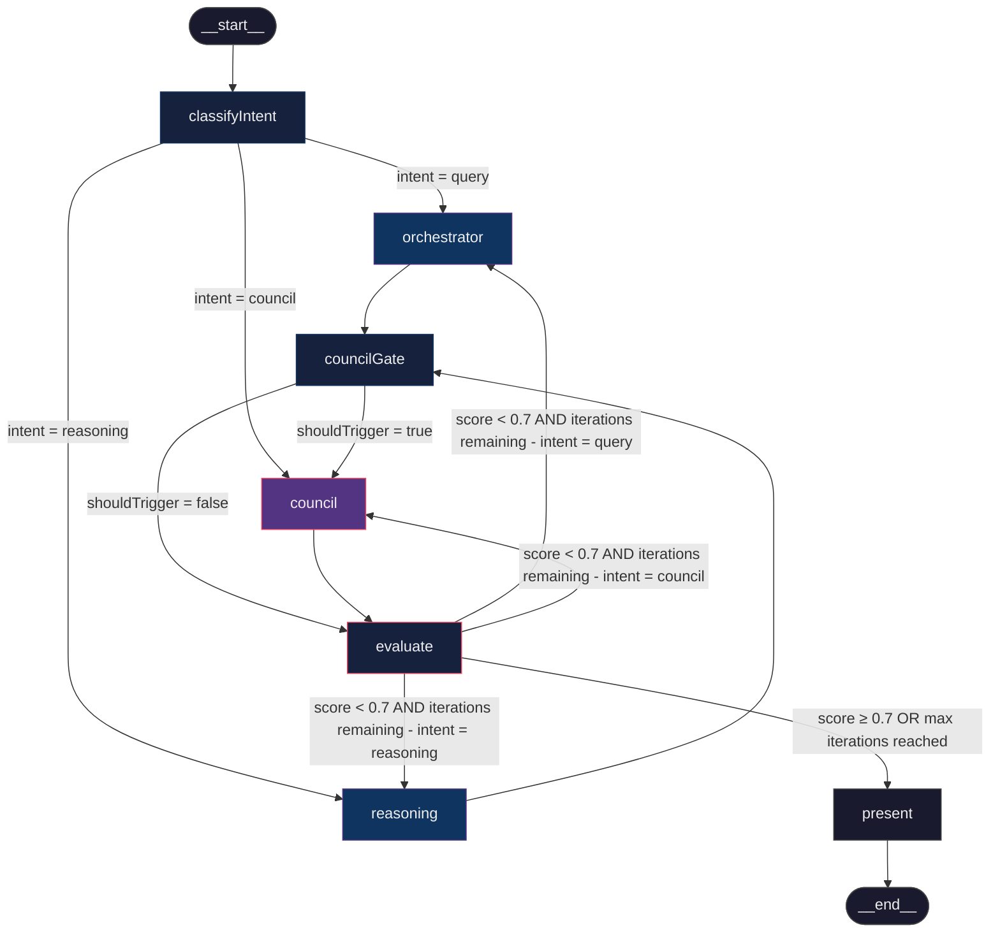
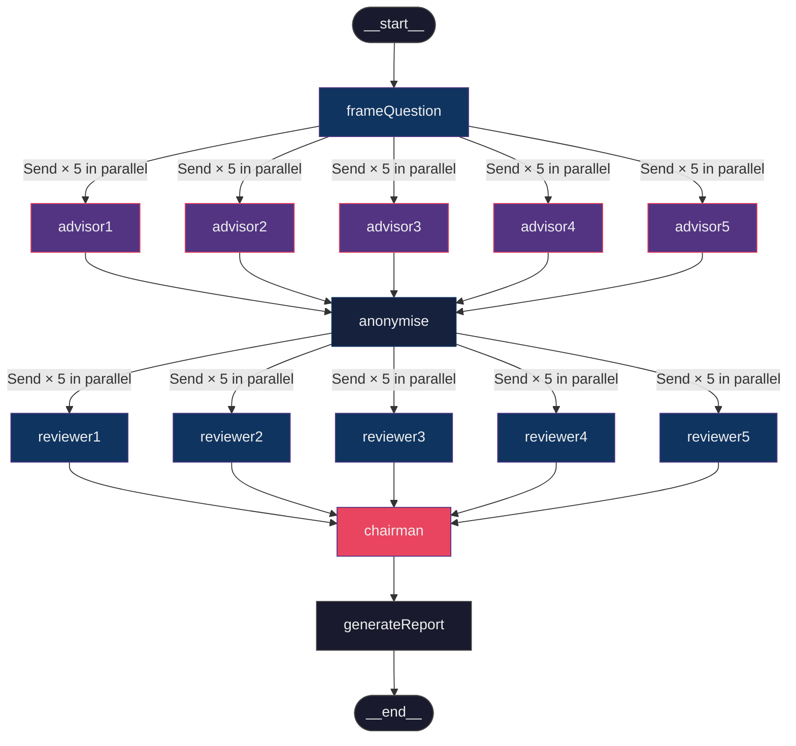
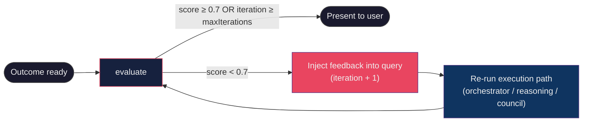
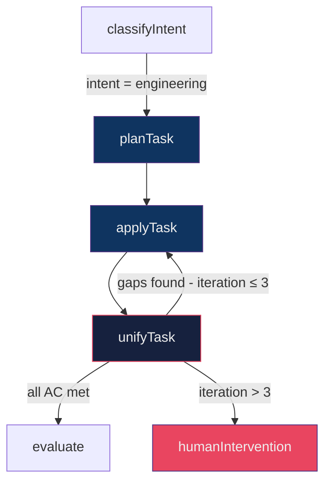
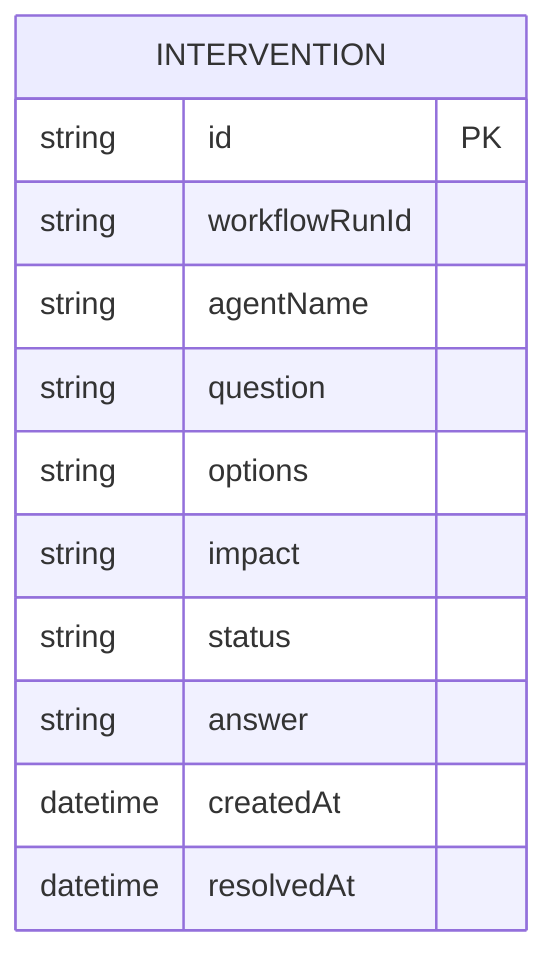
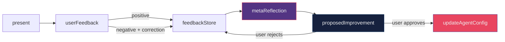

# International Space Bar — AI Workflow

This document describes the multi-agent AI workflow that powers the International Space Bar platform. The system is built on [LangGraph](https://langchain-ai.github.io/langgraphjs/) and orchestrates specialised agents to handle user queries end-to-end.

---

## Table of Contents

- [Director Workflow (top-level)](#director-workflow-top-level)
- [Council Sub-graph](#council-sub-graph)
- [Satisfaction Evaluation Loop](#satisfaction-evaluation-loop)
- [Agent Responsibilities](#agent-responsibilities)
- [Planned Evolution](#planned-evolution)
    - [Engineering Task Workflow](#1-engineering-task-workflow)
    - [Human Intervention Register](#2-human-intervention-register)
    - [Self-Reflection and Self-Improvement](#3-self-reflection-and-self-improvement)
    - [Build Capability](#4-build-capability)

---

## Director Workflow (top-level)

The top-level graph routes every user query through intent classification, dispatches it to the correct execution path, optionally escalates to the Council, and iterates until the outcome is satisfactory.

### Node descriptions

| Node             | Role                                                                         |
| ---------------- | ---------------------------------------------------------------------------- |
| `classifyIntent` | LLM structured-output classifier → `"query"`, `"reasoning"`, or `"council"`  |
| `orchestrator`   | Delegates to the **Orchestrator** agent; uses tools (web search, weather)    |
| `reasoning`      | Delegates to the **Reasoner** agent; chain-of-thought decomposition          |
| `councilGate`    | LLM binary classifier — decides if outcome warrants full council review      |
| `council`        | Runs the Council sub-graph (see below); produces a multi-perspective verdict |
| `evaluate`       | LLM satisfaction scorer (0–1); injects feedback into next iteration if < 0.7 |
| `present`        | Assembles the final response: outcome + optional council verdict             |

---

## Council Sub-graph

The Council sub-graph is invoked either directly (when intent = `"council"`) or after the council gate triggers. It runs a structured deliberation protocol with parallel advisor analysis and peer review.

### Council protocol steps

1. **Frame** — The Council Conductor scans workspace context (AGENTS.md, recent transcripts, memory) and rewrites the raw question as a clear, neutral prompt. Returns `STATUS: BLOCKED` if the question is too vague.
2. **Advise** — Five advisor workers run in parallel, each adopting a distinct identity: _The Contrarian_, _The First Principles Thinker_, _The Expansionist_, _The Outsider_, _The Executor_.
3. **Anonymise** — Advisor responses are shuffled and relabelled A–E so reviewers cannot infer identities from order.
4. **Review** — Five reviewers run in parallel. Each evaluates all five anonymised responses, surfacing the strongest, the biggest blind spot, and what all five missed.
5. **Synthesise** — The Chairman de-anonymises responses, reads all peer reviews, and produces a structured verdict: _Where the Council Agrees_, _Where it Clashes_, _Blind Spots_, _The Recommendation_, _The One Thing to Do First_.
6. **Report** — The verdict and full transcript are written to `logs/council-reports/` as Markdown files.

---

## Satisfaction Evaluation Loop

The `evaluate` node closes the feedback loop. It scores the outcome on four equally-weighted dimensions and either accepts the result or re-runs the execution path with targeted feedback.

### Evaluation dimensions

| Dimension         | Description                                      |
| ----------------- | ------------------------------------------------ |
| **Completeness**  | Did the response address all parts of the query? |
| **Accuracy**      | Are claims verifiable or well-reasoned?          |
| **Clarity**       | Is the response clear and well-structured?       |
| **Actionability** | Can the user act on this response?               |

- **Threshold**: 0.7 — scores below this trigger another iteration.
- **Max iterations**: 3 (default) — accepted regardless of score once reached.
- **Council baseline**: council verdicts start from 0.6 (multi-perspective synthesis is inherently thorough).

---

## Agent Responsibilities

| Agent                  | Model                                  | Role                                                                                                              |
| ---------------------- | -------------------------------------- | ----------------------------------------------------------------------------------------------------------------- |
| `agency-director`      | `glm-5.1:cloud`                        | Dispatch-only orchestrator. Classifies intent, routes to subagents, presents results. Never executes work itself. |
| `orchestrator`         | `glm-5.1:cloud`                        | Query executor. Uses tools (web search, weather) to answer user queries.                                          |
| `reasoner`             | `glm-5.1:cloud`                        | Systematic thinker. Chain-of-thought decomposition via the `reasoning` skill.                                     |
| `council.conductor`    | `glm-5.1:cloud` (opus alias)           | Frames raw questions into neutral, context-enriched council prompts.                                              |
| `council.sub.advisor`  | `deepseek-v4-pro:cloud` (sonnet alias) | Independent perspective analysis (one of five distinct identities).                                               |
| `council.sub.reviewer` | `glm-5.1:cloud` (opus alias)           | Peer review of anonymised advisor responses.                                                                      |
| `council.sub.chairman` | `glm-5.1:cloud` (opus alias)           | Synthesises all advisor responses and peer reviews into a structured verdict.                                     |

---

## Planned Evolution

The features below are **not yet implemented**. They represent the intended direction for this workflow to become a full engineering-task platform.

---

### 1. Engineering Task Workflow

> **Status: NOT YET IMPLEMENTED**

An additional intent class (`"engineering"`) and a dedicated execution path for software development tasks. This path would:

- Invoke the **PAU-loop** (Plan-Apply-Unify) skill as a mandatory execution protocol.
- Route tasks through an **engineer agent** (code generation), **tester agent** (test writing), and **QA agent** (acceptance verification).
- Pass outputs through the existing `evaluate` satisfaction loop.
- Produce build artefacts (see [Build Capability](#4-build-capability) below).

---

### 2. Human Intervention Register

> **Status: NOT YET IMPLEMENTED**

A persistent register of all `STATUS: BLOCKED` events raised by any agent in any workflow. The register would:

- Record the blocking agent, the question asked, options offered, impact, and timestamp.
- Expose a queryable interface so the user can see all pending interventions at once.
- Support resolution: when the user answers, the answer is written back to the register and the paused workflow is resumed with that context.
- Persist across sessions (file-based or lightweight database).

---

### 3. Self-Reflection and Self-Improvement

> **Status: NOT YET IMPLEMENTED**

A feedback loop that allows the system to update its own agent prompts and configuration based on accumulated user signals. The mechanism would:

- Capture explicit user feedback (thumbs up/down, free text correction) after each `present` node.
- Store feedback with the associated query, intent, and agent chain that produced the outcome.
- Periodically (or on demand) run a **meta-reflection** agent that analyses feedback patterns and proposes targeted prompt improvements.
- Write approved improvements back to `.agents/agents/*.yaml` (with a confirmation gate before any write).

---

### 4. Build Capability

> **Status: NOT YET IMPLEMENTED**

Tools that allow the engineering workflow to execute code and verify its correctness autonomously:

- **`run_command`** — executes shell commands (build, lint, test) in a sandboxed environment and returns stdout/stderr + exit code.
- **`read_file` / `write_file` / `edit_file`** — already partly available via agent `interrupt_on` configuration; needs formalisation as tool-layer primitives.
- **`run_tests`** — a higher-level tool that invokes the project's test runner and returns structured results (pass/fail counts, failing test names).
- **`run_lint`** — invokes `pnpm check` and returns structured lint errors with file paths and line numbers.

These tools would be registered in the **Tool Registry** (`src/international-space-bar/tool/`) and made available to the engineer agent on the engineering task path.
